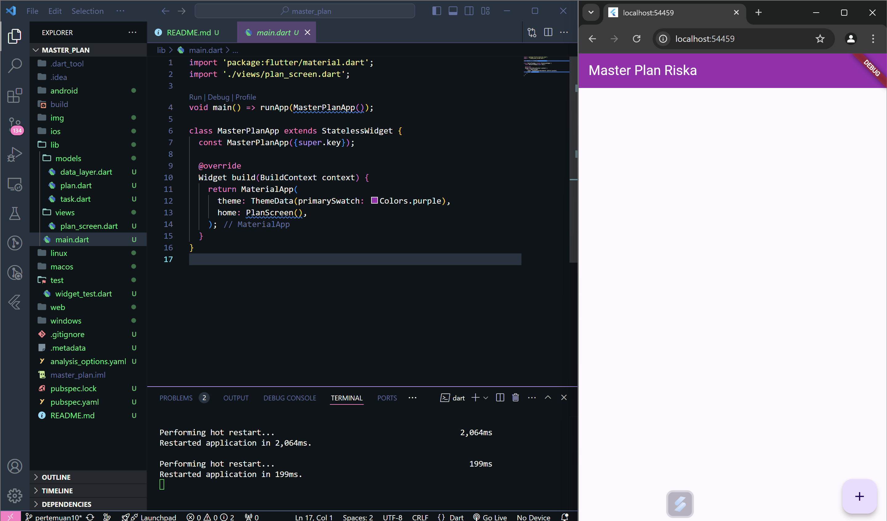
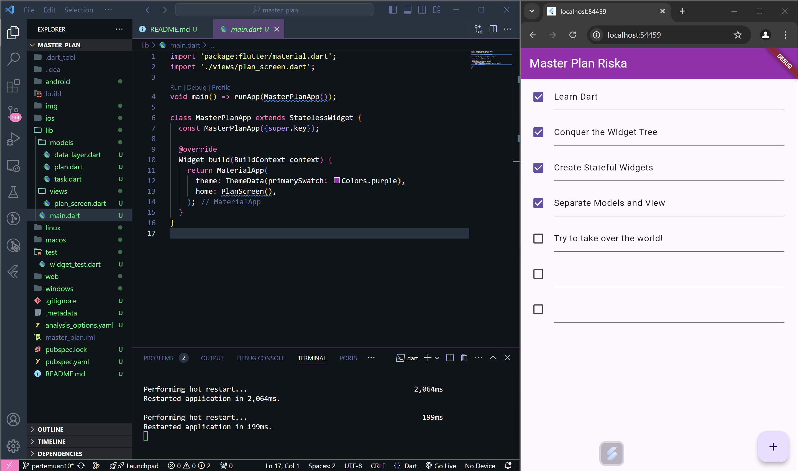
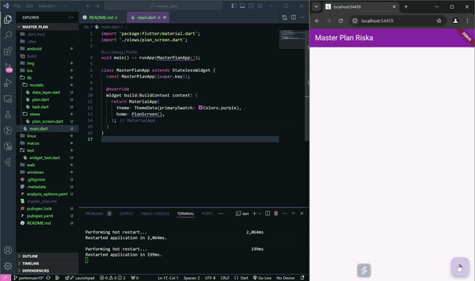

# **Praktikum 11 - Dasar State Management**

### Praktikum 1: Dasar State dengan Model-View

Selesaikan langkah-langkah praktikum berikut ini menggunakan editor Visual Studio Code (VS Code) atau Android Studio atau code editor lain kesukaan Anda.<p>

> Perhatian: Diasumsikan Anda telah berhasil melakukan setup environment Flutter SDK, VS Code, Flutter Plugin, dan Android SDK pada pertemuan pertama.<p>

## Langkah 1: Buat Project Baru
Buatlah sebuah project flutter baru dengan nama *master_plan* di folder *src week-11* repository GitHub Anda. Lalu buatlah susunan folder dalam project seperti gambar berikut ini.<p>
<p align="center">
  
</p>

## Langkah 2: Membuat model task.dart
Praktik terbaik untuk memulai adalah pada lapisan data (data layer). Ini akan memberi Anda gambaran yang jelas tentang aplikasi Anda, tanpa masuk ke detail antarmuka pengguna Anda. Di folder model, buat file bernama `task.dart` dan buat `class Task`. Class ini memiliki atribut `description` dengan tipe data String dan `complete` dengan tipe data Boolean, serta ada konstruktor. Kelas ini akan menyimpan data tugas untuk aplikasi kita. Tambahkan kode berikut:<p>

```dart
class Task {
  final String description;
  final bool complete;
  
  const Task({
    this.complete = false,
    this.description = '',
  });
}
```

## Langkah 3: Buat file plan.dart
Kita juga perlu sebuah List untuk menyimpan daftar rencana dalam aplikasi to-do ini. Buat file `plan.dart` di dalam folder *models* dan isi kode seperti berikut.<p>

```dart
import './task.dart';

class Plan {
  final String name;
  final List<Task> tasks;
  
  const Plan({this.name = '', this.tasks = const []});
}
```

## Langkah 4: Buat file data_layer.dart
Kita dapat membungkus beberapa data layer ke dalam sebuah file yang nanti akan mengekspor kedua model tersebut. Dengan begitu, proses impor akan lebih ringkas seiring berkembangnya aplikasi. Buat file bernama `data_layer.dart` di folder *models*. Kodenya hanya berisi export seperti berikut.<p>

```dart
export 'plan.dart';
export 'task.dart';
```

### Langkah 5: Pindah ke file main.dart
Ubah isi kode main.dart sebagai berikut.
```dart
import 'package:flutter/material.dart';
import './views/plan_screen.dart';

void main() => runApp(MasterPlanApp());

class MasterPlanApp extends StatelessWidget {
  const MasterPlanApp({super.key});

  @override
  Widget build(BuildContext context) {
    return MaterialApp(
     theme: ThemeData(primarySwatch: Colors.purple),
     home: PlanScreen(),
    );
  }
}
```

## Langkah 6: buat plan_screen.dart
Pada folder `views`, buatlah sebuah file `plan_screen.dart` dan gunakan templat StatefulWidget untuk membuat `class PlanScreen`. Isi kodenya adalah sebagai berikut. Gantilah teks *‘Namaku'* dengan nama panggilan Anda pada `title AppBar`.<p>

```dart
import '../models/data_layer.dart';
import 'package:flutter/material.dart';

class PlanScreen extends StatefulWidget {
  const PlanScreen({super.key});

  @override
  State createState() => _PlanScreenState();
}

class _PlanScreenState extends State<PlanScreen> {
  Plan plan = const Plan();

  @override
  Widget build(BuildContext context) {
   return Scaffold(
    // ganti ‘Namaku' dengan Nama panggilan Anda
    appBar: AppBar(title: const Text('Master Plan Riska')),
    body: _buildList(),
    floatingActionButton: _buildAddTaskButton(),
   );
  }
}
```

## Langkah 7: buat method _buildAddTaskButton()
Anda akan melihat beberapa error di langkah 6, karena method yang belum dibuat. Ayo kita buat mulai dari yang paling mudah yaitu tombol *Tambah Rencana*. Tambah kode berikut di bawah method `build` di dalam `class _PlanScreenState`.<p>

```dart
Widget _buildAddTaskButton() {
  return FloatingActionButton(
   child: const Icon(Icons.add),
   onPressed: () {
     setState(() {
      plan = Plan(
       name: plan.name,
       tasks: List<Task>.from(plan.tasks)
       ..add(const Task()),
     );
    });
   },
  );
}
```

## Langkah 8: buat widget _buildList()
Kita akan buat widget berupa `List` yang dapat dilakukan scroll, yaitu `ListView.builder`. Buat widget `ListView` seperti kode berikut ini.<p>

```dart
Widget _buildList() {
  return ListView.builder(
   itemCount: plan.tasks.length,
   itemBuilder: (context, index) =>
   _buildTaskTile(plan.tasks[index], index),
  );
}
```

## Langkah 9: buat widget _buildTaskTile
Dari langkah 8, kita butuh `ListTile` untuk menampilkan setiap nilai dari `plan.tasks`. Kita buat dinamis untuk setiap `index` data, sehingga membuat `view` menjadi lebih mudah. Tambahkan kode berikut ini.<p>

```dart
 Widget _buildTaskTile(Task task, int index) {
    return ListTile(
      leading: Checkbox(
          value: task.complete,
          onChanged: (selected) {
            setState(() {
              plan = Plan(
                name: plan.name,
                tasks: List<Task>.from(plan.tasks)
                  ..[index] = Task(
                    description: task.description,
                    complete: selected ?? false,
                  ),
              );
            });
          }),
      title: TextFormField(
        initialValue: task.description,
        onChanged: (text) {
          setState(() {
            plan = Plan(
              name: plan.name,
              tasks: List<Task>.from(plan.tasks)
                ..[index] = Task(
                  description: text,
                  complete: task.complete,
                ),
            );
          });
        },
      ),
    );
  }
```
Run atau tekan F5 untuk melihat hasil aplikasi yang Anda telah buat. Capture hasilnya untuk soal praktikum nomor 4.<p>


## Langkah 10: Tambah Scroll Controller
Anda dapat menambah tugas sebanyak-banyaknya, menandainya jika sudah beres, dan melakukan scroll jika sudah semakin banyak isinya. Namun, ada salah satu fitur tertentu di iOS perlu kita tambahkan. Ketika keyboard tampil, Anda akan kesulitan untuk mengisi yang paling bawah. Untuk mengatasi itu, Anda dapat menggunakan `ScrollController` untuk menghapus focus dari semua `TextField` selama event scroll dilakukan. Pada file `plan_screen.dart`, tambahkan variabel scroll controller di class State tepat setelah variabel `plan`.<p>

```dart
late ScrollController scrollController;
```

### Langkah 11: Tambah Scroll Listener
Tambahkan method `initState()` setelah deklarasi variabel scrollController seperti kode berikut.

```dart
@override
void initState() {
  super.initState();
  scrollController = ScrollController()
    ..addListener(() {
      FocusScope.of(context).requestFocus(FocusNode());
    });
}
```

## Langkah 12: Tambah controller dan keyboard behavior
Tambahkan controller dan keyboard behavior pada ListView di method `_buildList` seperti kode berikut ini.<p>

```dart
return ListView.builder(
  controller: scrollController,
 keyboardDismissBehavior: Theme.of(context).platform ==
 TargetPlatform.iOS
          ? ScrollViewKeyboardDismissBehavior.onDrag
          : ScrollViewKeyboardDismissBehavior.manual,
```

### Langkah 13: Terakhir, tambah method dispose()
Terakhir, tambahkan method `dispose()` berguna ketika widget sudah tidak digunakan lagi.
```dart
@override
void dispose() {
  scrollController.dispose();
  super.dispose();
}
```

## Langkah 14: Hasil
Lakukan Hot restart (bukan hot reload) pada aplikasi Flutter Anda. Anda akan melihat tampilan akhir seperti gambar berikut. Jika masih terdapat error, silakan diperbaiki hingga bisa running.



### **Tugas Praktikum 1: Dasar State dengan Model-View**
1. Selesaikan langkah-langkah praktikum tersebut, lalu dokumentasikan berupa GIF hasil akhir praktikum beserta penjelasannya di file README.md! Jika Anda menemukan ada yang error atau tidak berjalan dengan baik, silakan diperbaiki.<p>
   **jawab:**<p>
   [Praktikum 1: Dasar State dengan Model-View](#praktikum-1-dasar-state-dengan-model-view)<p>

2. Jelaskan maksud dari langkah 4 pada praktikum tersebut! Mengapa dilakukan demikian?<p>
   **jawab:**<p>
   Maksud dari langkah 4 adalah untuk mengelompokkan kode data layer ke dalam satu file yang bertujuan untuk mempermudah proses impor, terutama jika aplikasi berkembang dan memiliki lebih banyak model data. Sebelum langkah 4, kode data layer untuk Plan dan Task berada di file terpisah. Hal ini membuat proses impor kode data layer menjadi lebih rumit. Misalnya, jika kita ingin menggunakan model Plan di file plan_screen.dart, kita harus mengimpor file plan.dart terlebih dahulu. Dengan langkah 4, kita dapat mengimpor semua model data hanya dengan mengimpor file data_layer.dart yang akan membuat kode lebih ringkas dan mudah dibaca.<p>

3. Mengapa perlu variabel plan di langkah 6 pada praktikum tersebut? Mengapa dibuat konstanta ?<p>
   **jawab**<p>
   Karena untuk menyimpan data rencana yang akan ditampilkan. Variabel ini dibuat konstanta agar nilainya tidak dapat diubah setelah deklarasinya. Mengapa perlu variabel plan? Variabel plan diperlukan untuk menyimpan data rencana yang akan ditampilkan. Data rencana ini terdiri dari nama rencana dan daftar tugas yang ada di dalam rencana tersebut. Mengapa dibuat konstanta? Variabel plan dibuat konstanta agar nilainya tidak dapat diubah setelah deklarasinya. Hal ini dilakukan karena data rencana harus tetap konsisten selama aplikasi berjalan. Jika nilai variabel plan dapat diubah, maka data rencana yang ditampilkan juga akan berubah.<p>

4. Lakukan capture hasil dari Langkah 9 berupa GIF, kemudian jelaskan apa yang telah Anda buat!<p>
   **jawab:**<p>
   Pada langkah sembilan kita membuat _buildTaskFile, yaitu sebuah widget yang akan digunakan sebagai template task yang bersifat dinamis tergantung dari data yang ditampilkan. Widget ini menggunakan ListTile dimana terdapat checkbox pada leading ListTile, dan TextFormField untuk titlenya. Widget ini nantinya akan dipanggil pada widget _buildList, dan akan dilooping sebanyak data yang ada.<p>
  
   
5. Apa kegunaan method pada Langkah 11 dan 13 dalam lifecyle state ?<p>
   **jawab:**<p>
  Method initState adalah sebuah method yang akan dijalankan ketika class baru dibangun, maka inisialisasi variable dapat dilakukan di dalam method ini. Method yang kedua adalah dispose, method dispose merupakan method yang dipanggil ketika class tersebut dihancurkan, method ini cocok digunakan untuk melakukan dispose pada stream / controller, karena jika tidak di dispose maka akan tetap berjalan dan akan memakan banyak memori.<p>

6. Kumpulkan laporan praktikum Anda berupa link commit atau repository GitHub ke spreadsheet yang telah disediakan!
