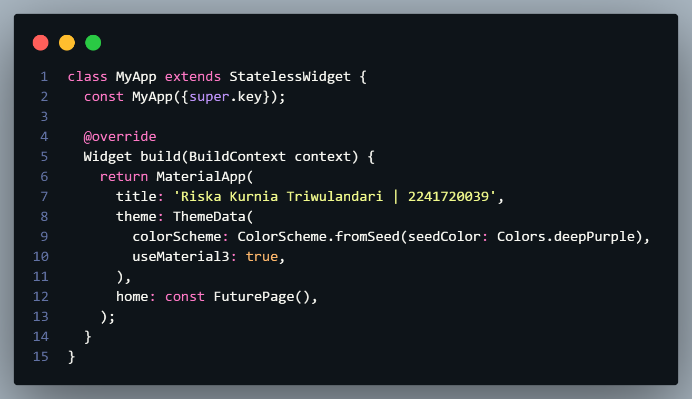
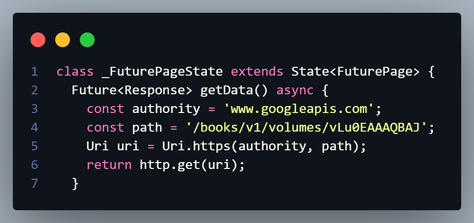
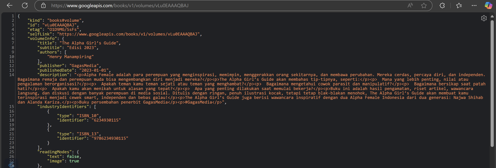
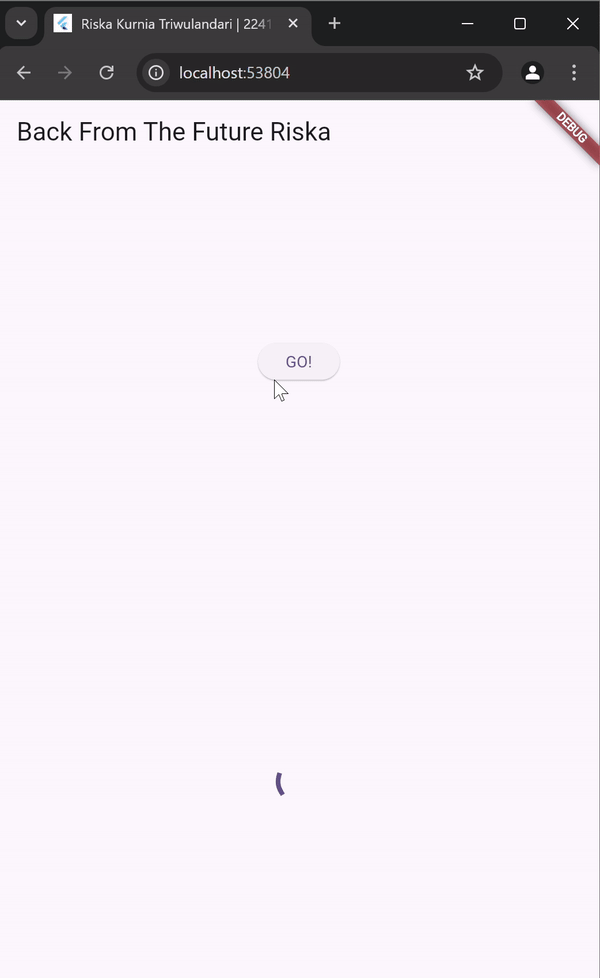
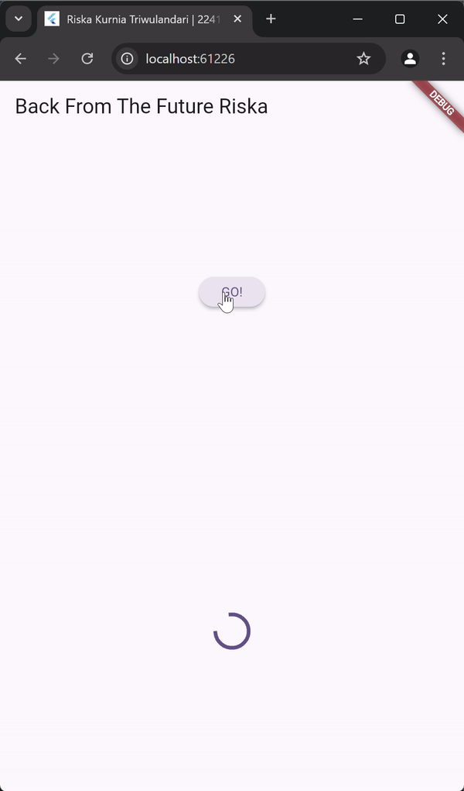
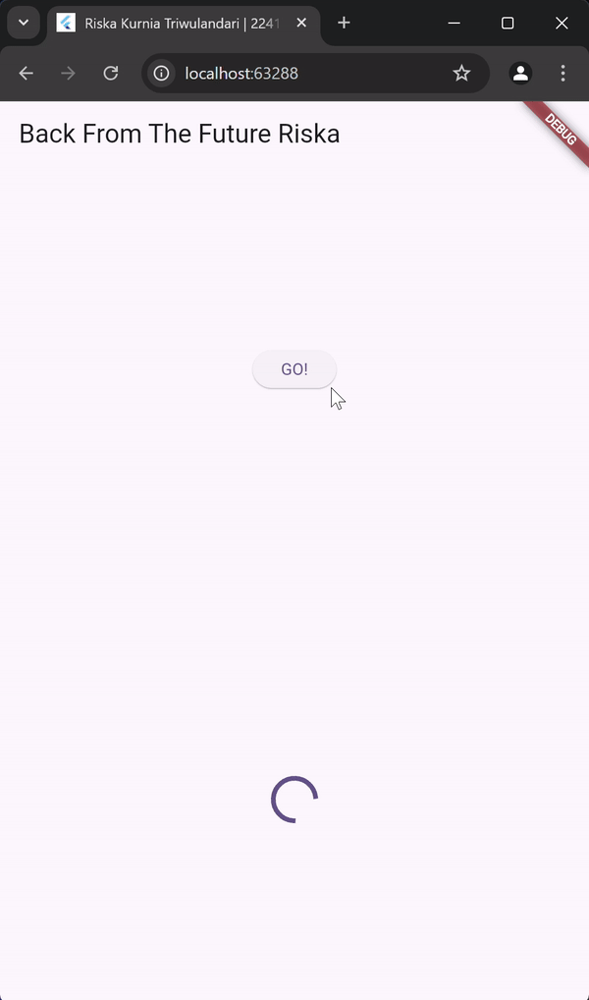
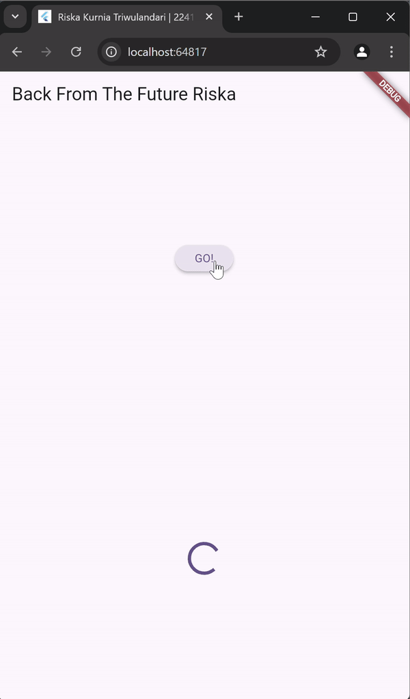
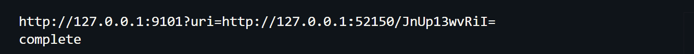
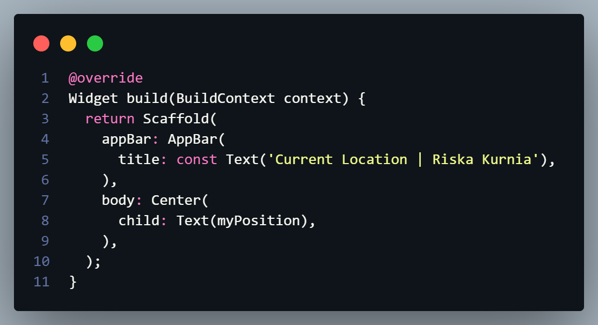
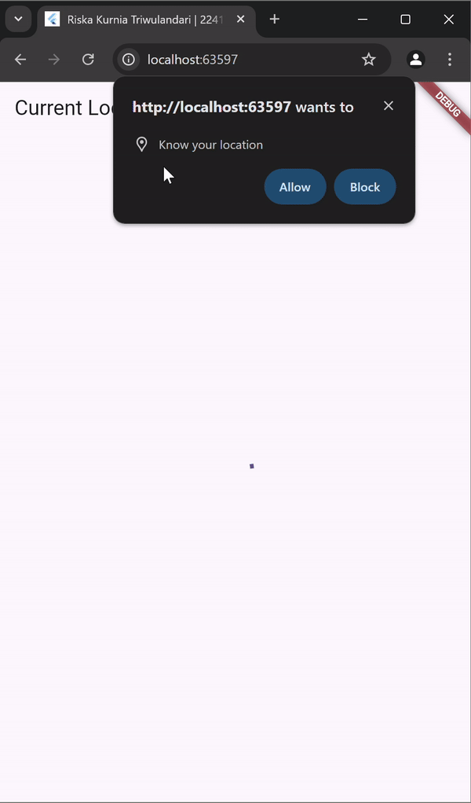

# Pemrograman Asynchronous

## Soal 1
Tambahkan **nama panggilan Anda** pada `title` app sebagai identitas hasil pekerjaan Anda. 
Jawab:

## Soal 2

- Carilah judul buku favorit Anda di Google Books, lalu ganti ID buku pada variabel `path` di kode tersebut. Caranya ambil di URL browser Anda seperti gambar berikut ini.

  

- Kemudian cobalah akses di browser URI tersebut dengan lengkap seperti ini. Jika menampilkan data JSON, maka Anda telah berhasil. Lakukan capture milik Anda dan tulis di `README` pada laporan praktikum. Lalu lakukan commit dengan pesan **"W11: Soal 2"**.

  

Jawab:

  

## Soal 3
Jelaskan maksud kode langkah 5 tersebut terkait `substring` dan `catchError`! 

Jawab: 

- `substring`: `substring(0, 450)` mengambil sebagian data dari respons HTTP. Dalam hal ini, hanya karakter pertama hingga karakter ke-450 dari body respons HTTP yang diambil.

- `catchError`: menangkap dan menangani kesalahan (error) yang terjadi saat memanggil Future (fungsi asinkron `getData`). Kesalahan ini bisa berupa kegagalan koneksi, URL tidak valid, atau respons yang tidak sesuai.

Capture hasil praktikum Anda berupa GIF dan lampirkan di README. Lalu lakukan commit dengan pesan **"W11: Soal 3"**. 

Jawab:

## Soal 4
Jelaskan maksud kode langkah 1 dan 2 tersebut! 

Jawab: 

- Langkah 1: menambahkan tiga metode asinkron (`returnOneAsync`, `returnTwoAsync`, `returnThreeAsync`) yang masing-masing mensimulasikan tugas dengan penundaan 3 detik menggunakan `Future.delayed` dan mengembalikan nilai tertentu (1, 2, atau 3).

- Langkah 2: menambahkan metode `count`, yang memanggil ketiga metode tersebut secara berurutan menggunakan `await`, menjumlahkan hasilnya, dan memperbarui UI dengan nilai total menggunakan setState. Metode ini mensimulasikan proses asinkron berurutan dan menampilkan hasil akhir setelah semua proses selesai. Total waktu eksekusi: 9 detik (karena pemanggilan dilakukan secara berurutan) dan hasil (1 + 2 + 3 = 6) diperbarui di UI.

Capture hasil praktikum Anda berupa GIF dan lampirkan di README. Lalu lakukan commit dengan pesan **"W11: Soal 4"**. 

Jawab:

## Soal 5
Jelaskan maksud kode langkah 2 tersebut! 

Jawab: 

Langkah 2 menambahkan mekanisme **`Completer`** yang memungkinkan kontrol manual terhadap penyelesaian sebuah `Future`. Variabel `completer` dideklarasikan sebagai `Completer<int>`, yang akan menghasilkan nilai integer. Method `getNumber` membuat instance `Completer` baru dan memulai proses asinkron melalui method `calculate`. `getNumber` mengembalikan `Future` dari `completer` yang akan selesai setelah `calculate` dipanggil. Dalam `calculate`, terdapat simulasi penundaan selama 5 detik menggunakan `Future.delayed`, setelah itu `completer.complete(42)` dipanggil untuk menyelesaikan `Future` dengan nilai `42`. Mekanisme ini memungkinkan kontrol eksplisit kapan dan bagaimana `Future` diselesaikan.

Capture hasil praktikum Anda berupa GIF dan lampirkan di README. Lalu lakukan commit dengan pesan **"W11: Soal 5"**. 

Jawab: 

## Soal 6
Jelaskan maksud perbedaan kode langkah 2 dengan langkah 5-6 tersebut! 

Jawab: 

Perbedaan utama antara Langkah 2 dengan Langkah 5-6 terletak pada penanganan kesalahan dan keandalan logika asinkron. Pada Langkah 2, method `calculate` hanya mensimulasikan operasi asinkron dengan `Future.delayed` selama 5 detik dan langsung menyelesaikan `Future` menggunakan `completer.complete(42)`. Namun, metode ini tidak memiliki mekanisme untuk menangani kesalahan jika terjadi error, sehingga rentan terhadap crash atau perilaku tak terduga. Sebaliknya, pada Langkah 5-6, method `calculate2` menambahkan blok **`try-catch`**, memungkinkan penangkapan kesalahan selama operasi asinkron. Jika terjadi error, method ini memanggil `completer.completeError({})` untuk menandai kegagalan. Selain itu, kode pada `onPressed` diperbarui untuk menangani dua skenario: ketika operasi berhasil, hasil (`42`) diperbarui di UI, dan jika terjadi error, pesan "An error occurred" ditampilkan. Perubahan ini meningkatkan keandalan aplikasi dengan menyediakan penanganan error yang eksplisit dan mencegah aplikasi crash. 

Capture hasil praktikum Anda berupa GIF dan lampirkan di README. Lalu lakukan commit dengan pesan **"W11: Soal 6"**. 

Jawab: 

## Soal 7
> Anda akan melihat hasilnya dalam 3 detik berupa angka 6 lebih cepat dibandingkan praktikum sebelumnya menunggu sampai 9 detik.

Capture hasil praktikum Anda berupa GIF dan lampirkan di README. Lalu lakukan commit dengan pesan **"W11: Soal 7"**. 

Jawab:

## Soal 8
Jelaskan maksud perbedaan kode langkah 1 dan 4! 

Jawab: 

Perbedaan utama antara Langkah 1 dan Langkah 4 adalah pendekatan untuk menjalankan beberapa operasi asinkron secara bersamaan. 

- Pada Langkah 1, **FutureGroup** digunakan untuk mengelola sekelompok `Future` secara dinamis. `Future` ditambahkan satu per satu menggunakan metode `add`, dan proses ditutup dengan `close()` sebelum hasilnya dikumpulkan. Pendekatan ini fleksibel jika jumlah `Future` tidak tetap dan perlu ditambahkan secara dinamis.

- Pada Langkah 4, **Future.wait** digunakan untuk menjalankan beberapa `Future` yang sudah diketahui sebelumnya dalam bentuk daftar. Semua `Future` berjalan bersamaan, dan ketika selesai, hasilnya dikembalikan dalam bentuk `List` tanpa memerlukan pengelolaan tambahan. Pendekatan ini lebih sederhana dan efisien untuk kasus statis di mana daftar `Future` sudah pasti. 

Jadi, **FutureGroup** cocok untuk kebutuhan dinamis, sedangkan **Future.wait** lebih ideal untuk operasi yang sederhana dan tetap.

## Soal 9
Capture hasil praktikum Anda berupa GIF dan lampirkan di README. Lalu lakukan commit dengan pesan **"W11: Soal 9"**. 

Jawab:

  

## Soal 10
Panggil method `handleError()` tersebut di `ElevatedButton`, lalu run. Apa hasilnya? Jelaskan perbedaan kode langkah 1 dan 4! 

Jawab: 

Method `returnError` mensimulasikan proses asinkron dengan menunda 2 detik menggunakan `Future.delayed`, lalu melemparkan sebuah exception dengan pesan **"Something terrible happened!"**. Di sisi lain, `handleError` menangkap exception ini menggunakan blok `try-catch`, kemudian memperbarui nilai `result` dengan pesan error tersebut dan menampilkan hasil di layar aplikasi. Blok `finally` memastikan pesan **"Complete"** selalu dicetak di konsol, terlepas dari apakah operasi berhasil atau gagal. Perbedaan utama antara langkah 1 dan 4 adalah bahwa `returnError` hanya mensimulasikan dan melempar error tanpa penanganan, sementara `handleError` menambahkan penanganan eksplisit terhadap kesalahan, memperbarui UI dengan pesan error, dan memastikan operasi tetap selesai dengan log tambahan, sehingga aplikasi lebih tangguh dan tidak mengalami crash.

## Soal 11
Tambahkan **nama panggilan Anda** pada tiap properti `title` sebagai identitas pekerjaan Anda.

## Soal 12
>Jika Anda tidak melihat animasi loading tampil, kemungkinan itu berjalan sangat cepat. Tambahkan delay pada method `getPosition()` dengan kode `await Future.delayed(const Duration(seconds: 3));` 

Apakah Anda mendapatkan koordinat GPS ketika run di browser? Mengapa demikian? 

Jawab: 

 

- Pada chrome saya bisa mendapat koordinat GPS, karena chrome mendukung berbagai API web yang memungkinkan akses ke berbagai perangkat keras, termasuk GPS (Geolocation API). Saya juga mengizinkan chrome untuk dapat menggunakan Geolocation API untuk mendapatkan koordinat geografis (latitude dan longitude). 

Capture hasil praktikum Anda berupa GIF dan lampirkan di README. Lalu lakukan commit dengan pesan **"W11: Soal 12"**. 

Jawab: 

 

 ## Soal 13
Apakah ada perbedaan UI dengan praktikum sebelumnya? Mengapa demikian? 

Jawab: 

Kedua praktikum menampilkan koordinat Geolokasi dengan layout yang sama. Hal ini terjadi karena keduanya mengambil lokasi pengguna secara langsung saat aplikasi dimulai.

Untuk pembaruan UI, pada praktikum pertama, `setState` digunakan untuk memperbarui variabel `state myPosition`. Pada praktikum kedua, `FutureBuilder` digunakan untuk mengelola pembaruan UI secara otomatis. Namun pada akhirnya, hasil tampilan UI terlihat sama karena keduanya memiliki penundaan yang sama, yakni 3 detik.

Capture hasil praktikum Anda berupa GIF dan lampirkan di README. Lalu lakukan commit dengan pesan **"W11: Soal 13"**. 

Jawab: 

Seperti yang Anda lihat, menggunakan FutureBuilder lebih efisien, clean, dan reactive dengan Future bersama UI.