### **Praktikum 1: Menerapkan Control Flows ("if/else")**

### **Langkah 1**
Ketik atau salin kode program berikut ke dalam fungsi main().

```dart
String test = "test2";
if (test == "test1") {
   print("Test1");
} else If (test == "test2") {
   print("Test2");
} Else {
   print("Something else");
}

if (test == "test2") print("Test2 again");
```

### **Langkah 2**
Silakan coba eksekusi (Run) kode pada langkah 1 tersebut. Apa yang terjadi? Jelaskan!

**JAWAB**
<p>
Terdapat beberapa masalah penulisan yang dapat menyebabkan error. </p>
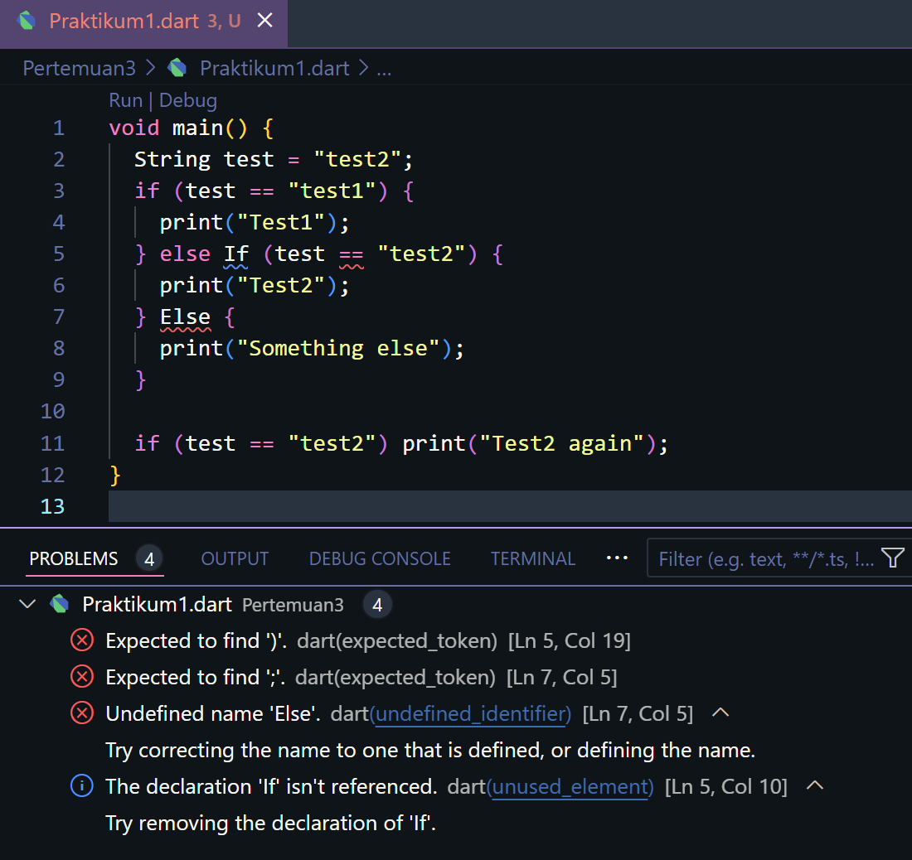<p>

Terdapat beberapa masalah yaitu:
- Menggunakan else If dan Else (dengan huruf besar) yang seharusnya ditulis sebagai else if dan else (dengan huruf kecil).
- Dalam Dart, kata kunci if, else dan else if harus ditulis dalam huruf kecil karena bersifat case-sensitive.

Berikut adalah kode yang sudah diperbaiki:
</p>
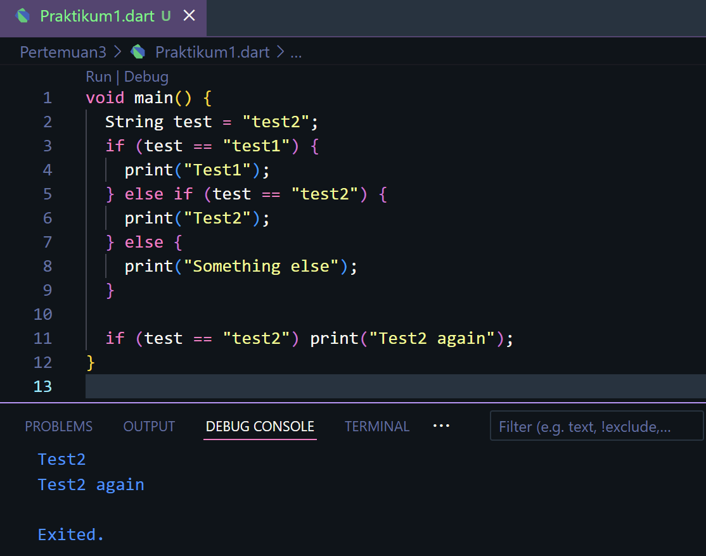<p>

### **Langkah 3**
Tambahkan kode program berikut, lalu coba eksekusi (Run) kode Anda.

```dart
String test = "true";
if (test) {
   print("Kebenaran");
}
```
Apa yang terjadi ? Jika terjadi error, silakan perbaiki namun tetap menggunakan if/else.

**JAWAB**<p>
Berikut adalah hasil eksekusi kode tersebut<p>
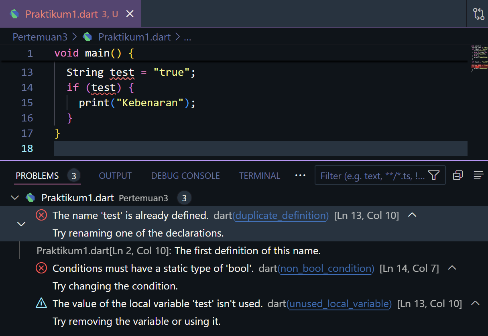<p>
Terdapat beberapa masalah dan error yaitu :
- Dalam kondisi if menggunakan sebuah string "true" adalah sebuah pernyataan yang salah, karena Dart tidak dapat mengonversi string ke boolean. Oleh karena itu tipe data ("true" dan "false") adalah boolean.
- Selain itu, harus mengubah "true" ke boolean true jika Anda ingin mencetak pesan "Kebenaran" ketika kondisinya benar.

Berikut adalah kode yang diperbaiki:

```dart
void main() {
  bool test = true; //ubah string menjadi boolean
  if (test) {
    print("Kebenaran");
  }
}
```
Dalam kode yang diperbaiki, variabel test telah dideklarasikan sebagai boolean true, dan kode akan berfungsi dengan benar. Ini akan mencetak "Kebenaran" karena kondisi if terpenuhi.
<br>
Berikut adalah hasil screenshot kode program.<p>
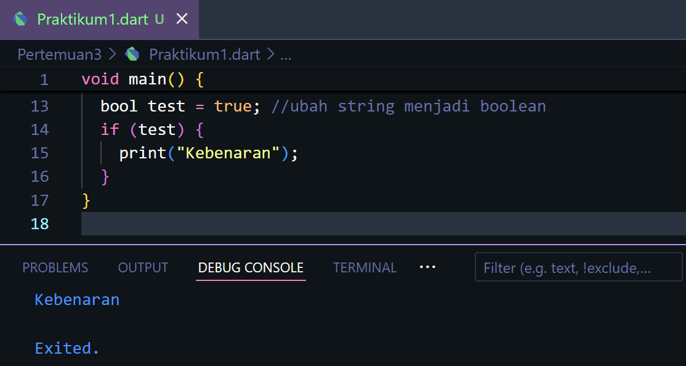<p>

### **Praktikum 2: Menerapkan Perulangan "while" dan "do-while"**

### **Langkah 1**
Ketik atau salin kode program berikut ke dalam fungsi main().

```dart
while (counter < 33) {
  print(counter);
  counter++;
}
```

### **Langkah 2**
Silakan coba eksekusi (Run) kode pada langkah 1 tersebut. Apa yang terjadi? Jelaskan! Lalu perbaiki jika terjadi error.

**JAWAB**<p>
Terdapat beberapa masalah yang dapat menyebabkan error saat dieksekusi.<p>
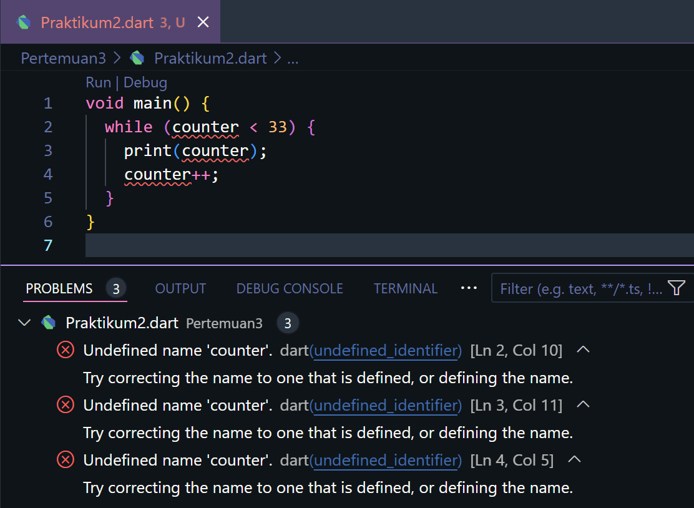<p>
Error terjadi karena variabel counter tidak dideklarasikan atau diinisialisasi sebelum digunakan. Jadi perlu mendeklarasikan dan menginisialisasi variabel counter sebelum menggunakannya. Misalnya, bisa menginisialisasi sebelum loop while.
Kode lengkap yang diperbaiki akan menjadi:
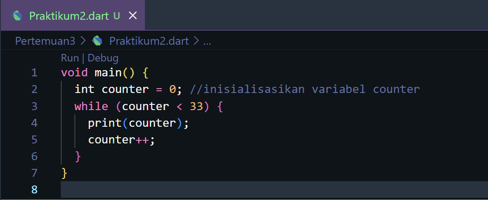<p>
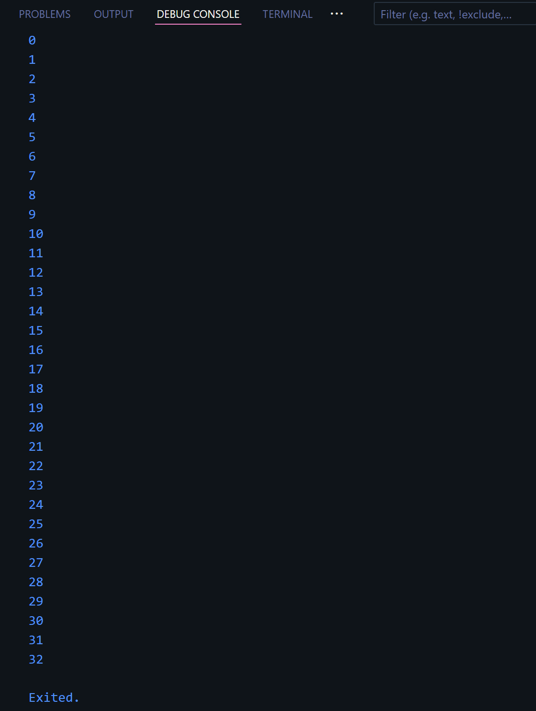<p>
Dengan demikian, kode tersebut akan berfungsi dengan baik. Itu akan mencetak angka dari 0 hingga 32 ke layar console.

### **Langkah 3**
Tambahkan kode program berikut, lalu coba eksekusi (Run) kode Anda.

```dart
do {
  print(counter);
  counter++;
} while (counter < 77);
```
Apa yang terjadi ? Jika terjadi error, silakan perbaiki namun tetap menggunakan do-while.

**JAWAB**<p>
Terdapat masalah yang akan menyebabkan error jika dijalankan.<p>
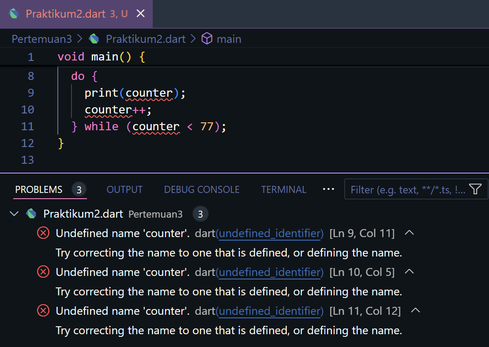<p>
Perlu mendeklarasikan dan menginisialisasi variabel counter sebelum menggunakannya, sama seperti yang telah saya sebutkan dalam langkah sebelumnya.<p>

Berikut adalah kode yang diperbaiki:

```dart
void main(){
  int counter = 0; //inisialisasi variabel counter
  do {
    print(counter);
    counter++;
  } while (counter < 77);
}

```
Dengan menambahkan inisialisasi variabel counter, kode tersebut akan berfungsi dengan baik. Itu akan mencetak angka dari 0 hingga 76 ke layar console.<p>
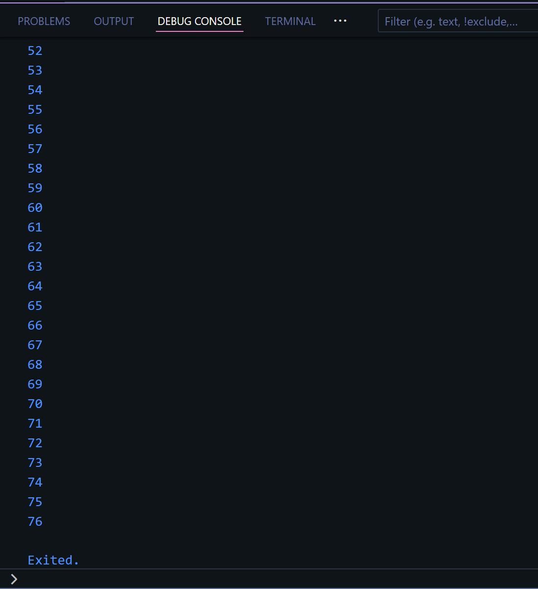<p>

### **Praktikum 3: Menerapkan Perulangan "for" dan "break-continue"**

### **Langkah 1**
Ketik atau salin kode program berikut ke dalam fungsi main().

```dart
for (Index = 10; index < 27; index) {
  print(Index);
}
```

### **Langkah 2**
Silakan coba eksekusi (Run) kode pada langkah 1 tersebut. Apa yang terjadi? Jelaskan! Lalu perbaiki jika terjadi error.

**JAWAB**<p>
Terdapat beberapa masalah yang dapat menyebabkan error saat dieksekusi.<p>
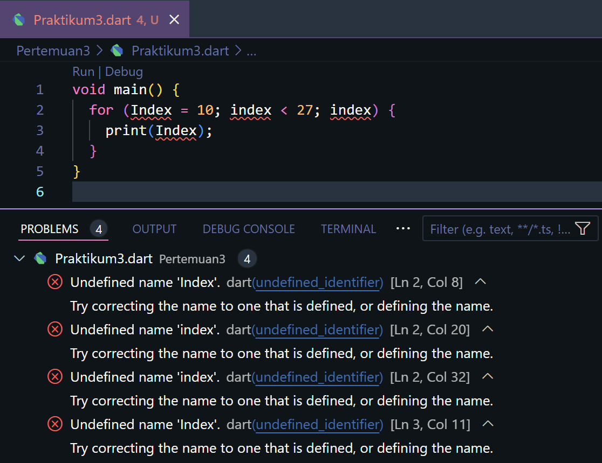<p>

- Variabel Index tidak dideklarasikan atau diinisialisasi sebelum digunakan.
- Dalam loop for, tidak dapat melakukan peningkatan nilai variabel Index. Oleh karena itu, loop ini akan menjadi loop tak berujung, yang akan mengakibatkan program berhenti merespons atau hang.
- Untuk memperbaiki kode tersebut, perlu mendeklarasikan dan menginisialisasi variabel Index, serta menambahkan langkah peningkatan nilai variabel Index dalam loop for. 

Berikut adalah kode yang diperbaiki:

```dart
void main(){
  for (int index = 10; index < 27; index++) {
    print(index);
  }
}
```

Dengan perbaikan ini, kode akan berfungsi dengan baik. Itu akan mencetak angka dari 10 hingga 26 ke layar console
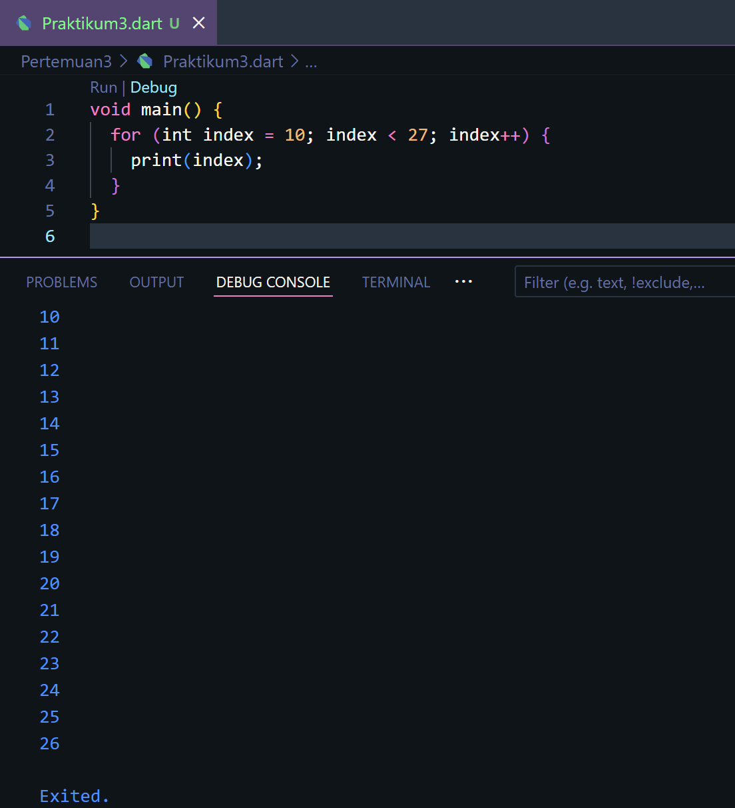<p>

### **Langkah 3**
Tambahkan kode program berikut di dalam for-loop, lalu coba eksekusi (Run) kode Anda.

```dart
If (Index == 21) break;
Else If (index > 1 || index < 7) continue;
print(index);
```
Apa yang terjadi ? Jika terjadi error, silakan perbaiki namun tetap menggunakan for dan break-continue.

**JAWAB**
Terdapat beberapa masalah yang perlu diperbaiki sebelum kode dapat dijalankan dengan benar<p>
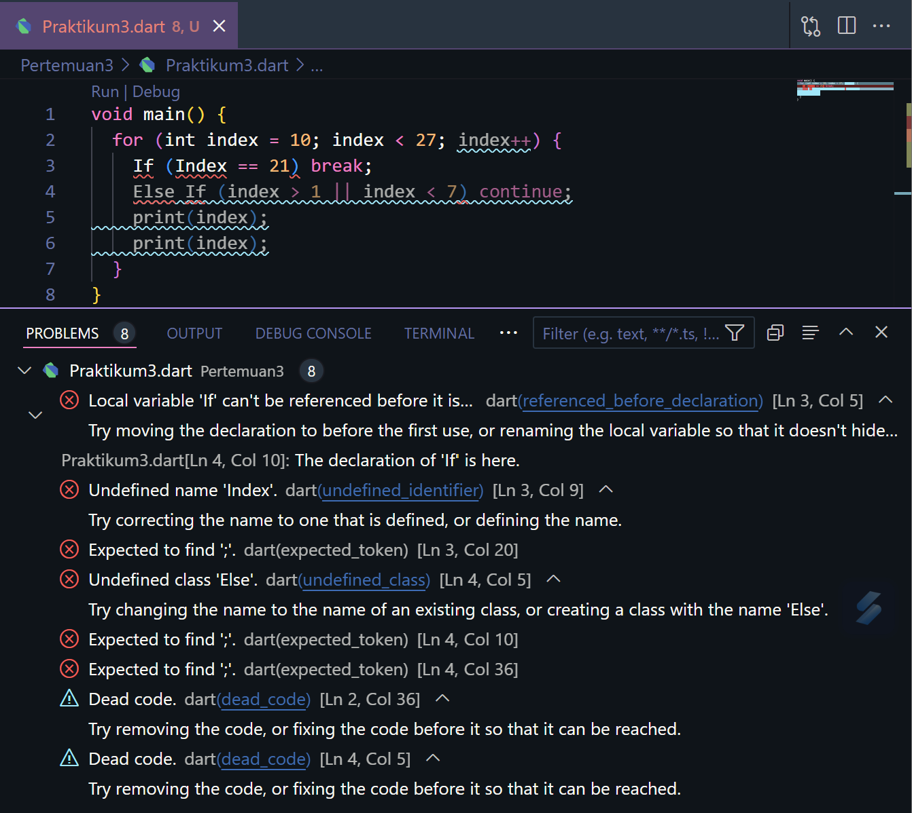<p>

- Kesalahan dalam penulisan kata kunci "if" dan "else if" harus diawali dengan huruf kecil (if dan else if), karena bersifat case-sensitive.
- Variabel index harus dideklarasikan dan diinisialisasi sebelum digunakan dalam kondisi.
- Kedua kondisi if dan else if yang Anda berikan memiliki logika yang bertentangan. Pertama, memeriksa apakah index sama dengan 21 dan jika iya, maka break. Namun, dalam kondisi kedua, memeriksa apakah index lebih besar dari 1 atau kurang dari 7, dan jika iya, maka continue. Kondisi kedua akan selalu benar karena angka 21 memenuhi kedua kondisi tersebut. Kedua kondisi ini akan mengakibatkan program berhenti sebelum mencetak apa pun.

Berikut adalah kode yang diperbaiki:

```dart
void main(){
  for (int index = 1; index <= 27; index++) {
    if (index == 21) {
      break;
    } else if (index > 1 && index < 7) {
      continue;
    }
    print(index);
  }
}

```
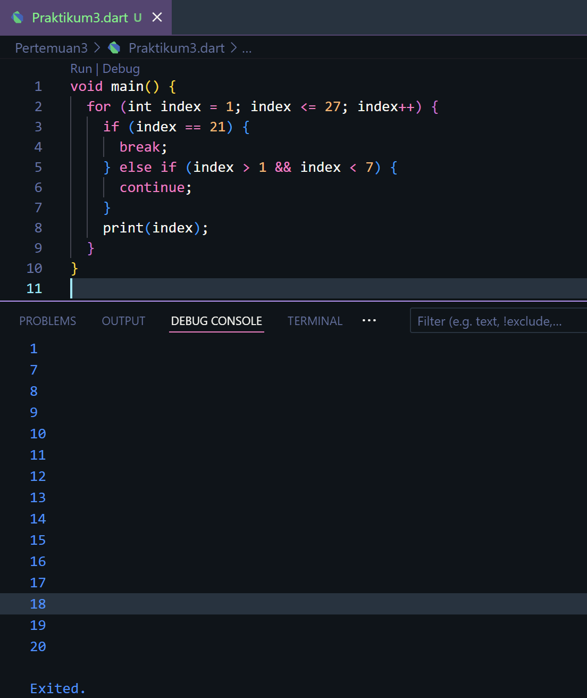<p>

- Perbaikan ini akan membuat program berfungsi dengan benar. Kode akan mencetak angka dari 1 hingga 27 kecuali angka 6 dan 21. Kode ini juga memastikan bahwa variabel Index dideklarasikan dan diinisialisasi sebelum digunakan dalam loop for.

### **Tugas Praktikum**
1. Silakan selesaikan Praktikum 1 sampai 3, lalu dokumentasikan berupa screenshot hasil pekerjaan beserta penjelasannya!<p>
**Jawab**<p>
- sudah saya jelaskan sebelumnya.

2. Buatlah sebuah program yang dapat menampilkan bilangan prima dari angka 0 sampai 201 menggunakan Dart. Ketika bilangan prima ditemukan, maka tampilkan nama lengkap dan NIM Anda.<p>
**Jawab**<p>

```dart

//Tugas
void main() {
  int batas = 201; 
  String nama = "Riska Kurnia Triwulandari";
  String nim = "2241720039";

  print("Nama : $nama");
  print("NIM : $nim");
  print("Bilangan prima dari 2 hingga $batas adalah:");
  algoritmaSieve(batas); // Mencetak bilangan prima secara mendatar
}

void algoritmaSieve(int batas) {
  // Inisialisasi list kosong untuk menampung bilangan prima
  List<int> bilanganPrima = []; 

  // Mencari dan menambahkan bilangan prima ke dalam list bilanganPrima
  for (int p = 2; p <= batas; p++) {
    if (cekBilanganPrima(p)) {
      bilanganPrima.add(p); // Tambahkan bilangan prima ke dalam list
    }
  }

  // Cetak hasilnya dalam satu baris, dipisahkan dengan koma
  print(bilanganPrima.join(', '));
}

bool cekBilanganPrima(int angka) {
  // Fungsi untuk mengecek apakah bilangan tersebut adalah prima
  if (angka <= 1) return false; //Bilangan kurang dari atau sama dengan 1 bukan bilangan prima.
  for (int i = 2; i * i <= angka; i++) { //Menguji apakah ada bilangan pembagi dari 2 hingga akar kuadrat dari angka
    if (angka % i == 0) { //Jika angka dapat dibagi habis oleh i, maka angka bukan bilangan prima.
      return false;
    }
  }
  return true;
}
```

Output :
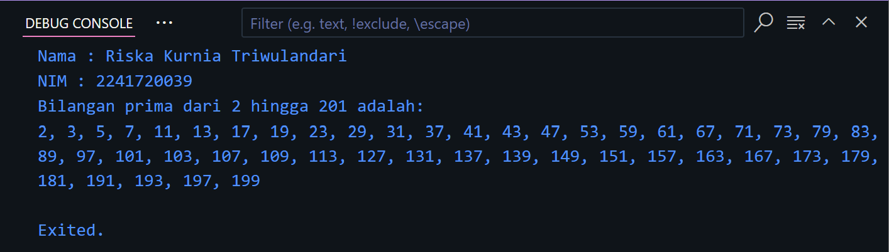<p>
