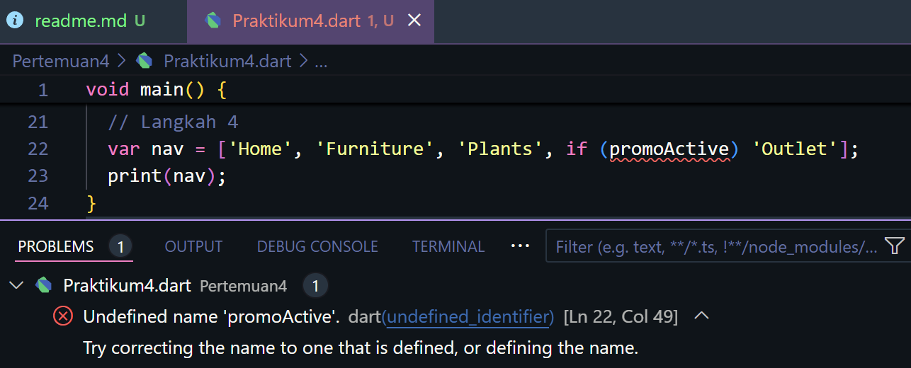
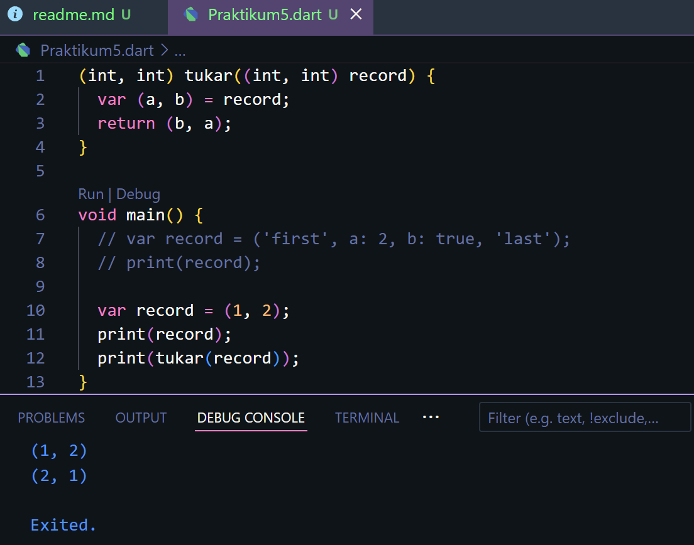

### **Praktikum 1: Eksperimen Tipe Data List**

### **Langkah 1**
Ketik atau salin kode program berikut ke dalam void main().

```dart
var list = [1, 2, 3];
assert(list.length == 3);
assert(list[1] == 2);
print(list.length);
print(list[1]);

list[1] = 1;
assert(list[1] == 1);
print(list[1]);
```

### **Langkah 2**
Silakan coba eksekusi (Run) kode pada langkah 1 tersebut. Apa yang terjadi? Jelaskan!
**JAWAB**
Hasil outputnya:
<p>
Jadi, kode tersebut digunakan untuk menginisialisasi sebuah list `[1, 2, 3]` dan menggunakan beberapa **assert** untuk memverifikasi bahwa panjang list adalah 3 dan elemen kedua awalnya bernilai 2. Kemudian, panjang list dan elemen kedua diprint (3 dan 2). Setelah itu, elemen kedua diubah menjadi 1, diverifikasi dengan **assert** lain, dan elemen kedua yang baru diprint (1). Jika semua kondisi **assert** terpenuhi, kode berjalan tanpa error dan menampilkan hasil di konsol: 3, 2, 1.

### **Langkah 3**
Ubah kode pada langkah 1 menjadi variabel final yang mempunyai index = 5 dengan default value = null. Isilah nama dan NIM Anda pada elemen index ke-1 dan ke-2. Lalu print dan capture hasilnya.

Apa yang terjadi ? Jika terjadi error, silakan perbaiki.

**JAWAB**
Berikut kode program dan hasilnya:
<p>
Kode tersebut membuat list "info" berisi 5 elemen yang diinisialisasi dengan null. Elemen indeks ke-1 diisi dengan "Riska Kurnia Triwulandari" dan indeks ke-2 dengan "2141720039". Kode lalu mencetak panjang list (5), serta elemen indeks ke-1 dan ke-2.

### **Praktikum 2: Eksperimen Tipe Data Set**

### **Langkah 1**
Ketik atau salin kode program berikut ke dalam fungsi main().

```dart
  var halogens = {'fluorine', 'chlorine', 'bromine', 'iodine', 'astatine'};
  print(halogens);
```

### **Langkah 2**
Silakan coba eksekusi (Run) kode pada langkah 1 tersebut. Apa yang terjadi? Jelaskan! Lalu perbaiki jika terjadi error.

**JAWAB**
Hasil outputnya:
<p>
Jadi, kode tersebut membuat sebuah set bernama halogens yang berisi lima unsur kimia: 'fluorine', 'chlorine', 'bromine', 'iodine', 'astatine'. Set merupakan struktur data yang tidak mengizinkan elemen duplikat dan tidak mempertahankan urutan elemen. Ketika kode dijalankan, set tersebut dicetak ke konsol, namun urutan elemen yang ditampilkan mungkin berbeda dari urutan awal karena sifat set yang tidak mempertahankan urutan. Kode ini tidak akan menghasilkan error dan akan mencetak isi set dengan benar.

### **Langkah 3**
Tambahkan kode program berikut, lalu coba eksekusi (Run) kode Anda.
```dart
void main() {
  var names1 = <String>{};
  Set<String> names2 = {}; // This works, too.
  var names3 = {}; // Creates a map, not a set.

  print(names1);
  print(names2);
  print(names3);
}
```
Apa yang terjadi ? Jika terjadi error, silakan perbaiki namun tetap menggunakan ketiga variabel tersebut. Tambahkan elemen nama dan NIM Anda pada kedua variabel Set tersebut dengan dua fungsi berbeda yaitu .add() dan .addAll(). Untuk variabel Map dihapus, nanti kita coba di praktikum selanjutnya.

**JAWAB**
Hasil outputnya:
<p>
Lalu tambahkan elemen nama dan NIM Anda pada kedua variabel Set tersebut dengan dua fungsi berbeda yaitu .add() dan .addAll().
<p>
Jadi, names1.add() digunakan untuk menambahkan elemen satu per satu ke dalam set names1, yaitu nama dan NIM. Sedangkan, names2.addAll() digunakan untuk menambahkan beberapa elemen sekaligus ke dalam set names2 menggunakan addAll().

### **Praktikum 3: Eksperimen Tipe Data Maps**

### **Langkah 1**
```dart
var gifts = {
  // Key:    Value
  'first': 'partridge',
  'second': 'turtledoves',
  'fifth': 1
};

var nobleGases = {
  2: 'helium',
  10: 'neon',
  18: 2,
};

print(gifts);
print(nobleGases);
```

### **Langkah 2**
Silakan coba eksekusi (Run) kode pada langkah 1 tersebut. Apa yang terjadi? Jelaskan! Lalu perbaiki jika terjadi error.

**JAWAB**
Hasil outputnya:
<p>
Variabel gifts dan nobleGases masing-masing adalah map yang menyimpan pasangan key-value. Pada gifts, key adalah 'first', 'second', dan 'fifth' dengan nilai yang sesuai, yaitu "partridge", "turtledoves", dan 1. Pada nobleGases, key berupa angka (2, 10, dan 18) dengan nilai yang sesuai, yaitu "helium", "neon", dan 2.

### **Langkah 3**
Tambahkan kode program berikut, lalu coba eksekusi (Run) kode Anda.
```dart
var mhs1 = Map<String, String>();
gifts['first'] = 'partridge';
gifts['second'] = 'turtledoves';
gifts['fifth'] = 'golden rings';

var mhs2 = Map<int, String>();
nobleGases[2] = 'helium';
nobleGases[10] = 'neon';
nobleGases[18] = 'argon';
```
Apa yang terjadi ? Jika terjadi error, silakan perbaiki.

Tambahkan elemen nama dan NIM Anda pada tiap variabel di atas (gifts, nobleGases, mhs1, dan mhs2). Dokumentasikan hasilnya dan buat laporannya!

**JAWAB**
Hasil outputnya:
<p>
Terjadi error tetapi tidak berpengaruh terhadap hasil:
<p>
Hal tersebut disebabkan dua map kosong, mhs1 dan mhs2, dideklarasikan tapi tidak digunakan atau dimodifikasi setelah deklarasi. Ini tidak akan menimbulkan error, namun deklarasi ini sebaiknya dihapus jika tidak digunakan. Berikut merupakan perbaikan kode:
<p>
Tambahkan elemen nama dan NIM Anda pada tiap variabel di atas (gifts, nobleGases, mhs1, dan mhs2).
<p>
<p>

### **Praktikum 4: Eksperimen Tipe Data List: Spread dan Control-flow Operators**

### **Langkah 1**
Ketik atau salin kode program berikut ke dalam fungsi main().
```dart
var list = [1, 2, 3];
var list2 = [0, ...list];
print(list1);
print(list2);
print(list2.length);
```

### **Langkah 2**
Silakan coba eksekusi (Run) kode pada langkah 1 tersebut. Apa yang terjadi? Jelaskan! Lalu perbaiki jika terjadi error.
**JAWAB**
Terjadi error seperti berikut:
<p>
Hal tersebut terjadi karena variabel list1 tiak didefinisikan. Kemudian supaya tidak error saya mengubah menjadi list.
<p>

### **Langkah 3**
Tambahkan kode program berikut, lalu coba eksekusi (Run) kode Anda.
```dart
list1 = [1, 2, null];
print(list1);
var list3 = [0, ...?list1];
print(list3.length);
```

Apa yang terjadi ? Jika terjadi error, silakan perbaiki.

Tambahkan variabel list berisi NIM Anda menggunakan Spread Operators. Dokumentasikan hasilnya dan buat laporannya!
**JAWAB**
Terjadi error seperti berikut:
<p>
Kode tersebut error dikarenakan variabel list1 belum dideklarasikan dan juga penggunaan null-aware operator tidak diperlukan karena variabel list1 tidak dapat bernilai null.

Berikut ini merupakan perbaikan kode:
<p>

Tambahkan variabel list berisi NIM Anda menggunakan Spread Operators.
<p>

### **Langkah 4**
Tambahkan kode program berikut, lalu coba eksekusi (Run) kode Anda.
```dart
var nav = ['Home', 'Furniture', 'Plants', if (promoActive) 'Outlet'];
print(nav);
```

Apa yang terjadi ? Jika terjadi error, silakan perbaiki. Tunjukkan hasilnya jika variabel promoActive ketika true dan false.
**JAWAB**
Terjadi error seperti berikut:
<p>
Kode tersebut error dikarenakan variabel promoActive tidak didefinisikan.
Berikut ini merupakan perbaikan kode:
promoActive = true
<p>
promoActive = false
<p>

### **Langkah 5**
Tambahkan kode program berikut, lalu coba eksekusi (Run) kode Anda.
```dart
var nav2 = ['Home', 'Furniture', 'Plants', if (login case 'Manager') 'Inventory'];
print(nav2);
```
Apa yang terjadi ? Jika terjadi error, silakan perbaiki. Tunjukkan hasilnya jika variabel login mempunyai kondisi lain.
**JAWAB**
Terjadi error seperti berikut:
<p>
Kode tersebut error dikarenakan variabel login tidak didefinisikan.
Berikut ini merupakan perbaikan kode:
<p>
Berikut jika variabel login mempunyai kondisi lain:
<p>

### **Langkah 6**
Tambahkan kode program berikut, lalu coba eksekusi (Run) kode Anda.
```dart
var listOfInts = [1, 2, 3];
var listOfStrings = ['#0', for (var i in listOfInts) '#$i'];
assert(listOfStrings[1] == '#1');
print(listOfStrings);
```
Apa yang terjadi ? Jika terjadi error, silakan perbaiki. Jelaskan manfaat Collection For dan dokumentasikan hasilnya.
**JAWAB**
Hasil outputnya:
<p>
Pada kode tersebut ekspresi 'collection for' digunakan untuk membuat daftar listOfStrings dengan mengiterasi melalui elemen-elemen dalam listOfInts dan menggabungkannya dengan tanda pagar (#). Pada listofStrings berisi [#0, #1, #2, #3]. Kemudian, kode memeriksa apakah elemen kedua dalam listOfStrings adalah '#2' menggunakan pernyataan assert. Lalu, isi dari listOfString dicetak.

### **Praktikum 5: Eksperimen Tipe Data Records**

### **Langkah 1**
Ketik atau salin kode program berikut ke dalam fungsi main().
```dart
var record = ('first', a: 2, b: true, 'last');
print(record)
```

### **Langkah 2**
Silakan coba eksekusi (Run) kode pada langkah 1 tersebut. Apa yang terjadi? Jelaskan! Lalu perbaiki jika terjadi error.
**JAWAB**
Terjadi error seperti berikut:
<p>
Kode tersebut error dikarenakan kurang tanda titik koma.
Berikut ini merupakan perbaikan kode:
<p>

### **Langkah 3**
Tambahkan kode program berikut di luar scope void main(), lalu coba eksekusi (Run) kode Anda.
```dart
(int, int) tukar((int, int) record) {
  var (a, b) = record;
  return (b, a);
}
```
Apa yang terjadi ? Jika terjadi error, silakan perbaiki. Gunakan fungsi tukar() di dalam main() sehingga tampak jelas proses pertukaran value field di dalam Records.
**JAWAB**
Hasil outputnya:
<p>
Fungsi tukar() menukar elemen pertama dan kedua dari tuple yang diberikan, dan hasilnya ditampilkan dengan nilai yang telah ditukar.

### **Langkah 4**
Tambahkan kode program berikut di dalam scope void main(), lalu coba eksekusi (Run) kode Anda.
```dart
// Record type annotation in a variable declaration:
(String, int) mahasiswa;
print(mahasiswa);
```
Apa yang terjadi ? Jika terjadi error, silakan perbaiki. Inisialisasi field nama dan NIM Anda pada variabel record mahasiswa di atas. Dokumentasikan hasilnya dan buat laporannya!
**JAWAB**
Terjadi error seperti berikut:
<p>
Kode tersebut error dikarenakan belum diinisialisasikan.
Berikut ini merupakan perbaikan kode:
<p>

### **Langkah 5**
Tambahkan kode program berikut di dalam scope void main(), lalu coba eksekusi (Run) kode Anda.
```dart
var mahasiswa2 = ('first', a: 2, b: true, 'last');

print(mahasiswa2.$1); // Prints 'first'
print(mahasiswa2.a); // Prints 2
print(mahasiswa2.b); // Prints true
print(mahasiswa2.$2); // Prints 'last'
```
Apa yang terjadi ? Jika terjadi error, silakan perbaiki. Gantilah salah satu isi record dengan nama dan NIM Anda, lalu dokumentasikan hasilnya dan buat laporannya!
**JAWAB**
Hasil outputnya:
<p>
Berikut kode 1 record dengan isi nama dan NIM:
<p>


### **Tugas Praktikum**
2. Jelaskan yang dimaksud Functions dalam bahasa Dart!
**Jawab**
Functions di Dart adalah blok kode yang digunakan untuk melakukan tugas tertentu dan dapat dipanggil berkali-kali. Seperti sebuah functions dapat memiliki parameter atau tidak. Functions dapat mengemmbalikan nilai atau tidak dan juga memiliki tipe kembalian atau tidak.

3. Jelaskan jenis-jenis parameter di Functions beserta contoh sintaksnya!
**Jawab**
- Positional Parameters: Parameter yang harus diisi berdasarkan urutan. Contoh:
<p>
- Named Parameters: Parameter yang diberikan dengan nama saat pemanggilan. Mereka bisa opsional. Contoh:
<p>
- Optional Positional Parameters: Parameter yang bisa diabaikan saat pemanggilan. Contoh:
<p>

4. Jelaskan maksud Functions sebagai first-class objects beserta contoh sintaknya!
**Jawab**
First-class objects, yang berarti fungsi dapat disimpan dalam variabel, diteruskan sebagai argumen ke fungsi lain, dikembalikan dari fungsi lain dan disimpan dalam struktur data seperti list atau map. Contoh:
<p>

5. Apa itu Anonymous Functions? Jelaskan dan berikan contohnya!
**Jawab**
Anonymous Functions (fungsi anonim) atau fungsi yang tidak diberi nama sering digunakan untuk tugas sementara atau satu kali. Contoh:
<p>

6. Jelaskan perbedaan Lexical scope dan Lexical closures! Berikan contohnya!
**Jawab**
- Lexical scope (atau static scope) adalah konsep di mana variabel yang dideklarasikan di dalam suatu blok kode hanya dapat diakses di dalam blok kode tersebut dan blok-blok yang bersarang di dalamnya. Contoh:
<p>
- Lexical closure adalah fungsi yang "menutup" atau menyimpan akses ke variabel dari lingkup luar meskipun lingkup luar tersebut sudah selesai dieksekusi. Contoh:
<p>

7. Jelaskan dengan contoh cara membuat return multiple value di Functions!
**Jawab**
Di Dart, tidak bisa secara langsung mengembalikan banyak nilai dari sebuah fungsi seperti di beberapa bahasa pemrograman lain. Tetapi bisa mengakalinya dengan cara:
- Menggunakan List
<p>
- Menggunakan Map
<p>
- Menggunakan class
<p>