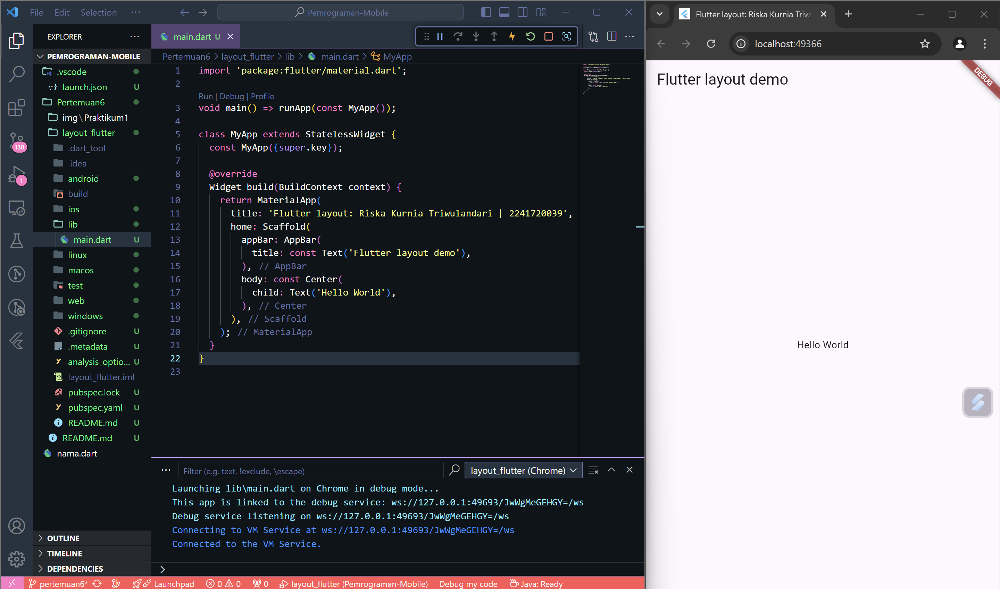
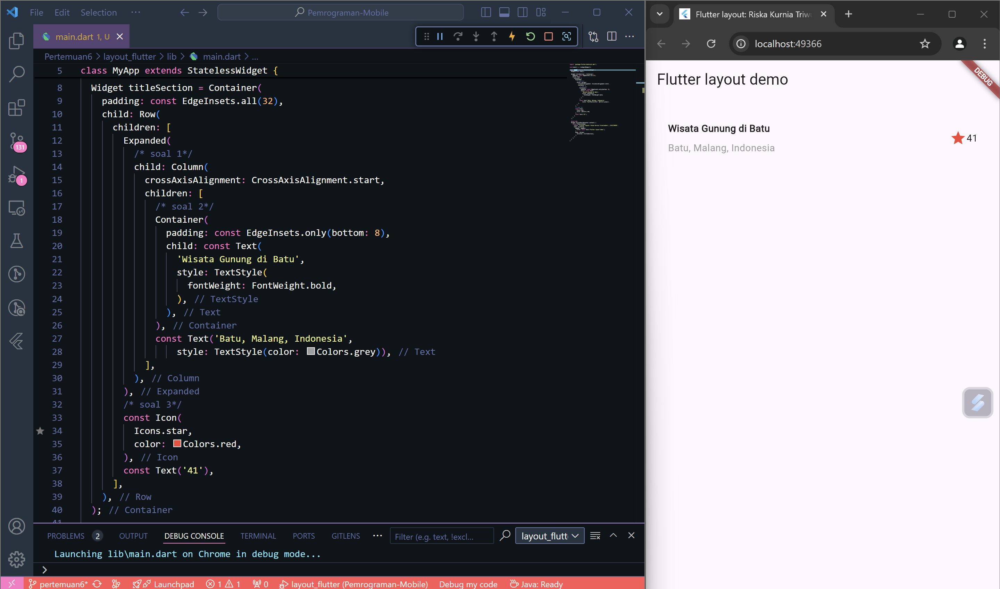

# Praktikum 1: Membangun Layout di Flutter
## Tampilan Akhir yang akan dibuat

## Langkah 1: Buat Project Baru
Membuat sebuah project flutter baru dengan nama <b>layout_flutter</b>.
## Langkah 2: Buka file lib/main.dart
Mengganti kode main. Isi nama dan NIM di text title.

```dart
import 'package:flutter/material.dart';

void main() => runApp(const MyApp());

class MyApp extends StatelessWidget {
  const MyApp({super.key});

  @override
  Widget build(BuildContext context) {
    return MaterialApp(
      title: 'Flutter layout: Riska Kurnia Triwulandari | 2241720039',
      home: Scaffold(
        appBar: AppBar(
          title: const Text('Flutter layout demo'),
        ),
        body: const Center(
          child: Text('Hello World'),
        ),
      ),
    );
  }
}
```
Output:</br>


## Langkah 3: Identifikasi layout diagram

## Langkah 4: Implementasi title row
Membuat kolom bagian kiri pada judul. Tambahkan kode berikut di bagian atas metode build() di dalam kelas MyApp:
```dart
Widget titleSection = Container(
  padding: const EdgeInsets.all(...),
  child: Row(
    children: [
      Expanded(
        /* soal 1*/
        child: Column(
          crossAxisAlignment: ...,
          children: [
            /* soal 2*/
            Container(
              padding: const EdgeInsets.only(bottom: ...),
              child: const Text(
                'Wisata Gunung di Batu',
                style: TextStyle(
                  fontWeight: FontWeight.bold,
                ),
              ),
            ),
            Text(
              'Batu, Malang, Indonesia',
              style: TextStyle(...),
            ),
          ],
        ),
      ),
      /* soal 3*/
      Icon(
       ...,
        color: ...,
      ),
      const Text(...),
    ],
  ),
);
```

<b>/* soal 1 */</b> Letakkan widget `Column` di dalam widget `Expanded` agar menyesuaikan ruang yang tersisa di dalam widget `Row`. Tambahkan properti `crossAxisAlignment` ke `CrossAxisAlignment.start` sehingga posisi kolom berada di awal baris.

<b>/* soal 2 */</b> Letakkan baris pertama teks di dalam `Container` sehingga memungkinkan Anda untuk menambahkan padding = 8. Teks `'Batu, Malang, Indonesia'` di dalam `Column`, set warna menjadi abu-abu.

<b>/* soal 3 */</b> Dua item terakhir di baris judul adalah ikon bintang, set dengan warna merah, dan teks "41". Seluruh baris ada di dalam `Container` dan beri padding di sepanjang setiap tepinya sebesar 32 piksel. Kemudian ganti isi ``body text 'Hello World'`` dengan variabel ``titleSection``</br>

Kode setelah soal diselesaikan:
```dart
import 'package:flutter/material.dart';

void main() => runApp(MyApp());

class MyApp extends StatelessWidget {
  MyApp({super.key});
  
  Widget titleSection = Container(
  padding: const EdgeInsets.all(32),
  child: Row(
    children: [
      Expanded(
        /* soal 1*/
        child: Column(
          crossAxisAlignment: CrossAxisAlignment.start,
          children: [
            /* soal 2*/
            Container(
              padding: const EdgeInsets.only(bottom: 8),
              child: const Text(
                'Wisata Gunung di Batu',
                style: TextStyle(
                  fontWeight: FontWeight.bold,
                ),
              ),
            ),
            const Text(
              'Batu, Malang, Indonesia',
              style: TextStyle(color: Colors.grey)),
          ],
        ),
      ),
      /* soal 3*/
      const Icon(
        Icons.star,
        color: Colors.red,
      ),
      const Text('41'),
      ],
    ),
  );

  @override
  Widget build(BuildContext context) {
    return MaterialApp(
      title: 'Flutter layout: Riska Kurnia Triwulandari | 2241720039',
      home: Scaffold(
        appBar: AppBar(
          title: const Text('Flutter layout demo'),
        ),
        body: Column(
          children: [titleSection],
        ),
      ),
    );
  }
}
```

Output:</br>
