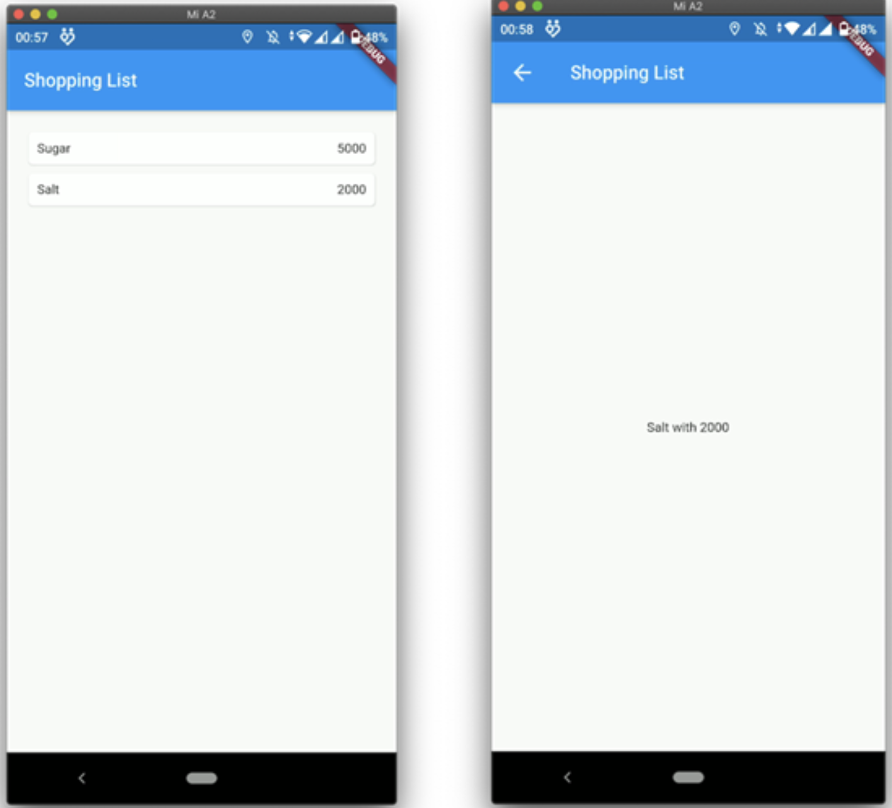
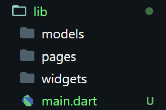
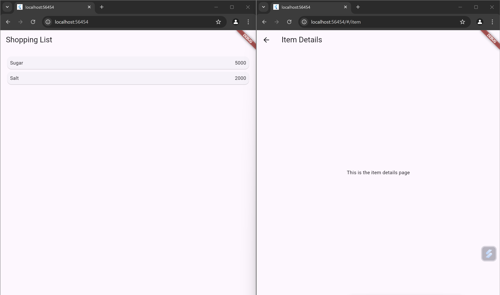
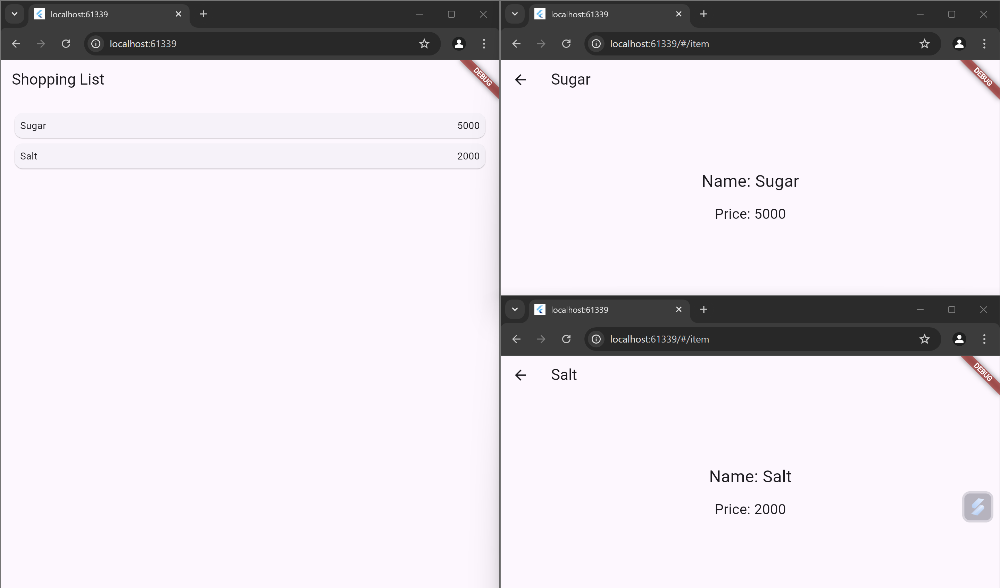
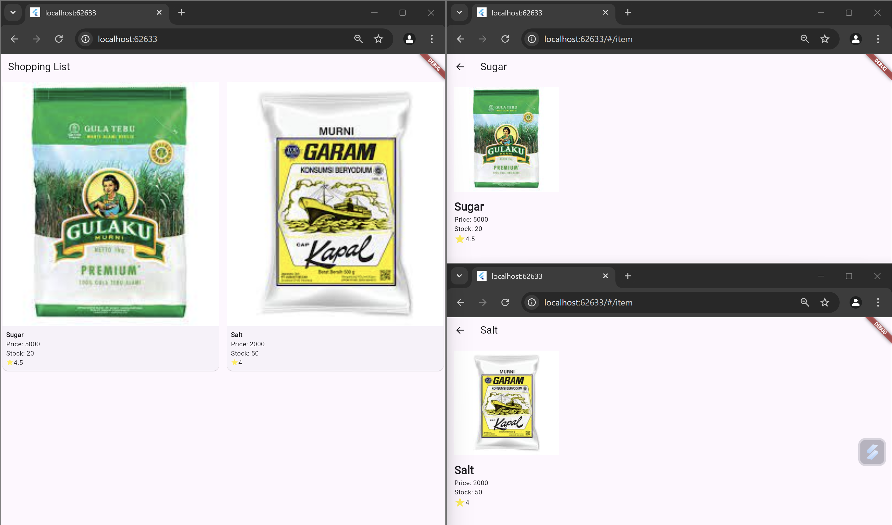
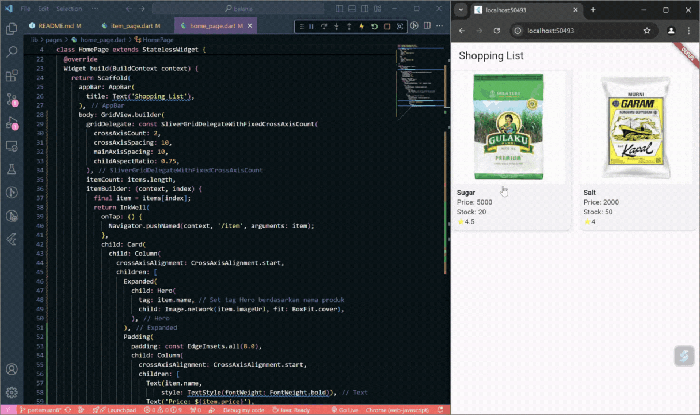
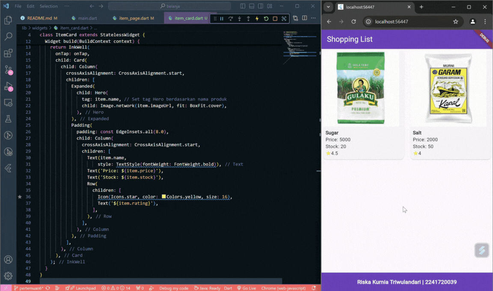
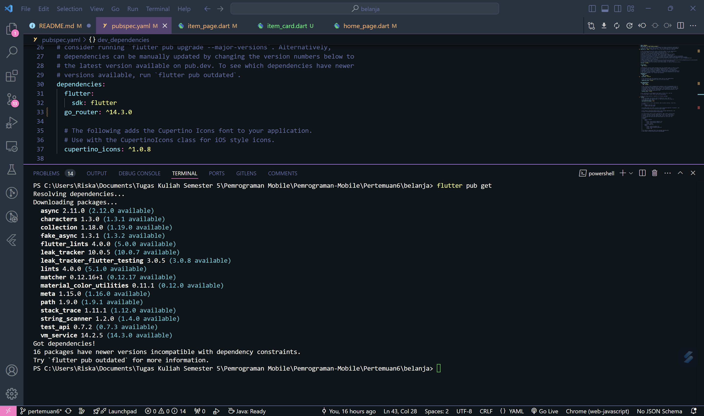
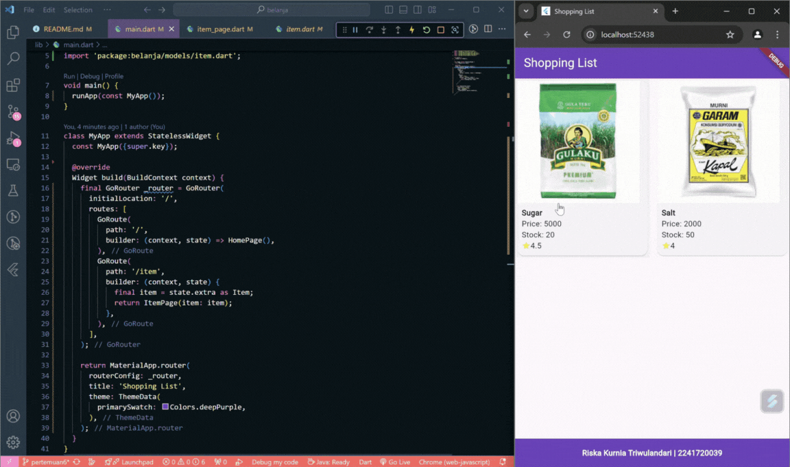

# Praktikum 5: Membangun Navigasi di Flutter
## Tampilan akhir yang akan Anda buat
 <br>

Pada praktikum 5 ini anda akan belajar mengenai pembangunan aplikasi bergerak multi halaman. Aplikasi yang dikembangkan berupa kasus daftar barang belanja. Pada aplikasi ini anda akan belajar untuk berpindah halaman dan mengirimkan data ke halaman lainnya. Gambaran mockup hasil akhir aplikasi dapat anda lihat pada gambar di atas (mockup dibuat sederhana, sehingga Anda mempunyai banyak ruang untuk berkreasi). Desain aplikasi menampilkan sebuah ListView widget yang datanya bersumber dari List. Ketika item ditekan, data akan dikirimkan ke halaman berikutnya.

## Langkah 1: Siapkan project baru
Buatlah sebuah project baru Flutter dengan nama belanja dan susunan folder seperti pada gambar berikut. Penyusunan ini dimaksudkan untuk mengorganisasi kode dan widget yang lebih mudah. <br>


## Langkah 2: Mendefinisikan Route
Buatlah dua buah file dart dengan nama home_page.dart dan item_page.dart pada folder pages. Untuk masing-masing file, deklarasikan class HomePage pada file home_page.dart dan ItemPage pada item_page.dart. Turunkan class dari StatelessWidget. Gambaran potongan kode dapat anda lihat sebagai berikut.

```dart
class HomePage extends StatelessWidget {
  @override
  Widget build(BuildContext context) {
    // TODO: implement build
    throw UnimplementedError();
  }
}

class ItemPage extends StatelessWidget {
  @override
  Widget build(BuildContext context) {
    // TODO: implement build
    throw UnimplementedError();
  }
}
```

## Langkah 3: Lengkapi Kode di main.dart
Setelah kedua halaman telah dibuat dan didefinisikan, bukalah file main.dart. Pada langkah ini anda akan mendefinisikan Route untuk kedua halaman tersebut. Definisi penamaan route harus bersifat unique. Halaman HomePage didefinisikan sebagai /. Dan halaman ItemPage didefinisikan sebagai /item. Untuk mendefinisikan halaman awal, anda dapat menggunakan named argument initialRoute. Gambaran tahapan ini, dapat anda lihat pada potongan kode berikut.<br>
```dart
void main() {
  runApp(MaterialApp(
    initialRoute: '/',
    routes: {
      '/': (context) => HomePage(),
      '/item': (context) => ItemPage(),
    },
  ));
}
```

## Langkah 4: Membuat data model
Sebelum melakukan perpindahan halaman dari HomePage ke ItemPage, dibutuhkan proses pemodelan data. Pada desain mockup, dibutuhkan dua informasi yaitu nama dan harga. Untuk menangani hal ini, buatlah sebuah file dengan nama item.dart dan letakkan pada folder models. Pada file ini didefinisikan pemodelan data yang dibutuhkan. Ilustrasi kode yang dibutuhkan, dapat anda lihat pada potongan kode berikut.<br>
```dart
class Item {
  String name;
  int price;

  Item({required this.name, required this.price});
}
```

## Langkah 5: Lengkapi kode di class HomePage
Pada halaman HomePage terdapat ListView widget. Sumber data ListView diambil dari model List dari object Item. Gambaran kode yang dibutuhkan untuk melakukan definisi model dapat anda lihat sebagai berikut.<br>
```dart
class HomePage extends StatelessWidget {
  final List<Item> items = [
    Item(name: 'Sugar', price: 5000),
    Item(name: 'Salt', price: 2000),
  ];
```

## Langkah 6: Membuat ListView dan itemBuilder
Untuk menampilkan ListView pada praktikum ini digunakan itemBuilder. Data diambil dari definisi model yang telah dibuat sebelumnya. Untuk menunjukkan batas data satu dan berikutnya digunakan widget Card. Kode yang telah umum pada bagian ini tidak ditampilkan. Gambaran kode yang dibutuhkan dapat anda lihat sebagai berikut.<br>
```dart
      body: Container(
        margin: EdgeInsets.all(8),
        child: ListView.builder(
          padding: EdgeInsets.all(8),
          itemCount: items.length,
          itemBuilder: (context, index) {
            final item = items[index];
            return InkWell(
              onTap: () {
                Navigator.pushNamed(context, '/item');
              },
              child: Card(
                child: Container(
                  margin: EdgeInsets.all(8),
                  child: Row(
                    children: [
                      Expanded(child: Text(item.name)),
                      Expanded(
                        child: Text(
                          item.price.toString(),
                          textAlign: TextAlign.end,
                        ),
                      ),
                    ],
                  ),
                ),
              ),
            );
          },
        ),
      ),
```

## Langkah 7: Menambahkan aksi pada ListView
Item pada ListView saat ini ketika ditekan masih belum memberikan aksi tertentu. Untuk menambahkan aksi pada ListView dapat digunakan widget ```InkWell``` atau ```GestureDetector```. Perbedaan utamanya ```InkWell``` merupakan material widget yang memberikan efek ketika ditekan. Sedangkan ```GestureDetector``` bersifat umum dan bisa juga digunakan untuk gesture lain selain sentuhan. Pada praktikum ini akan digunakan widget ```InkWell```.

Untuk menambahkan sentuhan, letakkan cursor pada widget pembuka Card. Kemudian gunakan shortcut quick fix dari VSCode (<b>Ctrl +</b> . pada Windows atau <b>Cmd +</b> . pada MacOS). Sorot menu wrap ```with widget...``` Ubah nilai widget menjadi ```InkWell``` serta tambahkan named argument onTap yang berisi fungsi untuk berpindah ke halaman ```ItemPage```. Ilustrasi potongan kode dapat anda lihat pada potongan berikut.<br>
```dart
return InkWell(
    onTap: () {
        Navigator.pushNamed(context, '/item');
    },
```

Output:</br>


# Tugas Praktikum 2
1. Untuk melakukan pengiriman data ke halaman berikutnya, cukup menambahkan informasi arguments pada penggunaan ```Navigator```. Perbarui kode pada bagian ```Navigator``` menjadi seperti berikut.
```dart
Navigator.pushNamed(context, '/item', arguments: item);
```
Perintah tersebut berfungsi untuk menavigasi ke halaman (rute) /item sambil mengirimkan data item sebagai argumen ke halaman tersebut. Ini memungkinkan halaman tujuan untuk menerima dan menggunakan data yang dikirim, misalnya untuk menampilkan detail dari item yang dipilih.<br></br>

2. Pembacaan nilai yang dikirimkan pada halaman sebelumnya dapat dilakukan menggunakan ```ModalRoute```. Tambahkan kode berikut pada blok fungsi build dalam halaman ```ItemPage```. Setelah nilai didapatkan, anda dapat menggunakannya seperti penggunaan variabel pada umumnya. (https://docs.flutter.dev/cookbook/navigation/navigate-with-arguments) 
<br></br>

```dart
final itemArgs = ModalRoute.of(context)!.settings.arguments as Item;
```

* item_page.dart
```dart
import 'package:flutter/material.dart';
import 'package:belanja/models/item.dart';

class ItemPage extends StatelessWidget {
  @override
  Widget build(BuildContext context) {
    final Item item = ModalRoute.of(context)!.settings.arguments as Item;

    return Scaffold(
      appBar: AppBar(
        title: Text(item.name),
      ),
      body: Center(
        child: Column(
          mainAxisAlignment: MainAxisAlignment.center,
          children: [
            Text(
              'Name: ${item.name}',
              style: TextStyle(fontSize: 24),
            ),
            SizedBox(height: 16),
            Text(
              'Price: ${item.price}',
              style: TextStyle(fontSize: 20),
            ),
          ],
        ),
      ),
    );
  }
}
```

* home_page.dart dan output:
```dart
import 'package:flutter/material.dart';
import 'package:belanja/models/item.dart';

class HomePage extends StatelessWidget {
  final List<Item> items = [
    Item(name: 'Sugar', price: 5000),
    Item(name: 'Salt', price: 2000),
  ];
  @override
  Widget build(BuildContext context) {
    return Scaffold(
      appBar: AppBar(
        title: Text('Shopping List'),
      ),
      body: Container(
        margin: EdgeInsets.all(8),
        child: ListView.builder(
          padding: EdgeInsets.all(8),
          itemCount: items.length,
          itemBuilder: (context, index) {
            final item = items[index];
            return InkWell(
              onTap: () {
                Navigator.pushNamed(context, '/item', arguments: item);
              },
              child: Card(
                child: Container(
                  margin: EdgeInsets.all(8),
                  child: Row(
                    children: [
                      Expanded(child: Text(item.name)),
                      Expanded(
                        child: Text(
                          item.price.toString(),
                          textAlign: TextAlign.end,
                        ),
                      ),
                    ],
                  ),
                ),
              ),
            );
          },
        ),
      ),
    );
  }
}
```

Output:</br>


Jadi, pada HomePage pengguna memilih item, dan data item dikirim ke ItemPage melalui Navigator.pushNamed. Kemudian pada ItemPage, kode ModalRoute.of(context)!.settings.arguments as Item; mengambil data item tersebut, sehingga bisa digunakan untuk menampilkan detail item yang dipilih oleh pengguna.
<br>

3. Pada hasil akhir dari aplikasi belanja yang telah anda selesaikan, tambahkan atribut foto produk, stok, dan rating. Ubahlah tampilan menjadi GridView seperti di aplikasi marketplace pada umumnya.

### Langkah 1: Perbarui Model Item
Tambahkan atribut imageUrl, stock, dan rating ke model Item.
```dart
class Item {
  String name;
  int price;
  String imageUrl; // URL foto produk
  int stock; // Stok produk
  double rating; // Rating produk (dari 0.0 hingga 5.0)

  Item({
    required this.name,
    required this.price,
    required this.imageUrl,
    required this.stock,
    required this.rating,
  });
}
```
### Langkah 2: Perbarui Data Produk
Tambahkan data produk dengan atribut baru untuk gambar, stok, dan rating.
```dart
final List<Item> items = [
  Item(
    name: 'Sugar',
    price: 5000,
    imageUrl: 'https://encrypted-tbn0.gstatic.com/images?q=tbn:ANd9GcTIsocjOR3DbpK_gtYbFoHTZ_IkFhUvFOxPDSufQydZMSylgv9I-On43ljdk8XfFEJuMtE&usqp=CAU',
    stock: 20,
    rating: 4.5,
  ),
  Item(
    name: 'Salt',
    price: 2000,
    imageUrl: 'https://encrypted-tbn0.gstatic.com/images?q=tbn:ANd9GcQLCFe3k1T35W-bhRF9j-3V1matg9RbTazwa9UfJJuILvEwJ4UZowcksFSOk1U7xZc9O_g&usqp=CAU',
    stock: 50,
    rating: 4.0,
  ),
];
```

### Langkah 3: Ubah ListView Menjadi GridView
Ubah tampilan dari ListView menjadi GridView.builder. Gunakan GridTile untuk setiap item produk.
```dart
@override
  Widget build(BuildContext context) {
    return Scaffold(
      appBar: AppBar(
        title: Text('Shopping List'),
      ),
      body: GridView.builder(
        gridDelegate: const SliverGridDelegateWithFixedCrossAxisCount(
          crossAxisCount: 2, // Jumlah kolom grid
          crossAxisSpacing: 10,
          mainAxisSpacing: 10,
          childAspectRatio: 0.75, // Rasio tinggi-lebar kotak produk
        ),
        itemCount: items.length,
        itemBuilder: (context, index) {
          final item = items[index];
          return InkWell(
            onTap: () {
              Navigator.pushNamed(context, '/item', arguments: item);
            },
            child: Card(
              child: Column(
                crossAxisAlignment: CrossAxisAlignment.start,
                children: [
                  Expanded(
                    child: Image.network(item.imageUrl,
                        fit: BoxFit.cover), // Tampilkan gambar produk
                  ),
                  Padding(
                    padding: const EdgeInsets.all(8.0),
                    child: Column(
                      crossAxisAlignment: CrossAxisAlignment.start,
                      children: [
                        Text(item.name,
                            style: TextStyle(fontWeight: FontWeight.bold)),
                        Text('Price: ${item.price}'),
                        Text('Stock: ${item.stock}'),
                        Row(
                          children: [
                            Icon(Icons.star, color: Colors.yellow, size: 16),
                            Text('${item.rating}'),
                          ],
                        ),
                      ],
                    ),
                  ),
                ],
              ),
            ),
          );
        },
      ),
    );
  }
```
### Langkah 4: Perbarui ItemPage untuk Menampilkan Atribut Baru
Tampilkan semua atribut produk yang dikirim saat pindah ke halaman ItemPage.
```dart
import 'package:flutter/material.dart';
import 'package:belanja/models/item.dart';

class ItemPage extends StatelessWidget {
  @override
  Widget build(BuildContext context) {
    final itemArgs = ModalRoute.of(context)!.settings.arguments as Item;

    return Scaffold(
      appBar: AppBar(
        title: Text(itemArgs.name),
      ),
      body: Padding(
        padding: const EdgeInsets.all(16.0),
        child: Column(
          crossAxisAlignment: CrossAxisAlignment.start,
          children: [
            Image.network(itemArgs.imageUrl), // Tampilkan gambar produk
            SizedBox(height: 16),
            Text(
              itemArgs.name,
              style: TextStyle(fontSize: 24, fontWeight: FontWeight.bold),
            ),
            Text('Price: ${itemArgs.price}'),
            Text('Stock: ${itemArgs.stock}'),
            Row(
              children: [
                Icon(Icons.star, color: Colors.yellow),
                Text('${itemArgs.rating}'),
              ],
            ),
          ],
        ),
      ),
    );
  }
}
```
### Penjelasan 
- **GridView**: Menggunakan `GridView.builder` untuk menampilkan produk dalam bentuk kotak-kotak seperti di aplikasi marketplace. Kita atur 2 kolom (`crossAxisCount: 2`), serta menambahkan `mainAxisSpacing` dan `crossAxisSpacing` untuk memberi jarak antar item.
- **Image.network**: Digunakan untuk menampilkan gambar dari URL.
- **Card**: Membungkus tiap item dengan `Card` agar terlihat lebih rapi.
- **Rating**: Ditampilkan menggunakan `Icon` bintang dan `Text` rating.
- **Stock dan Harga**: Ditampilkan di dalam widget `Text`.

Output:</br>


4. Silakan implementasikan Hero widget pada aplikasi belanja Anda dengan mempelajari dari sumber ini: https://docs.flutter.dev/cookbook/navigation/hero-animations 

### Langkah 1: Menambahkan Hero pada HomePage
Kita akan menambahkan `Hero` widget di sekitar `Image.network` pada `HomePage`, dan memberikan `tag` yang unik berdasarkan produk yang di-click.

```dart
import 'package:flutter/material.dart';
import 'package:belanja/models/item.dart';

class HomePage extends StatelessWidget {
  final List<Item> items = [
    Item(
      name: 'Sugar',
      price: 5000,
      imageUrl: 'images/sugar.png',
      stock: 20,
      rating: 4.5,
    ),
    Item(
      name: 'Salt',
      price: 2000,
      imageUrl: 'images/salt.png',
      stock: 50,
      rating: 4.0,
    ),
  ];

  @override
  Widget build(BuildContext context) {
    return Scaffold(
      appBar: AppBar(
        title: Text('Shopping List'),
      ),
      body: GridView.builder(
        gridDelegate: const SliverGridDelegateWithFixedCrossAxisCount(
          crossAxisCount: 2,
          crossAxisSpacing: 10,
          mainAxisSpacing: 10,
          childAspectRatio: 0.75,
        ),
        itemCount: items.length,
        itemBuilder: (context, index) {
          final item = items[index];
          return InkWell(
            onTap: () {
              Navigator.pushNamed(context, '/item', arguments: item);
            },
            child: Card(
              child: Column(
                crossAxisAlignment: CrossAxisAlignment.start,
                children: [
                  Expanded(
                    child: Hero(
                      tag: item.name, // Set tag Hero berdasarkan nama produk
                      child: Image.network(item.imageUrl, fit: BoxFit.cover),
                    ),
                  ),
                  Padding(
                    padding: const EdgeInsets.all(8.0),
                    child: Column(
                      crossAxisAlignment: CrossAxisAlignment.start,
                      children: [
                        Text(item.name,
                            style: TextStyle(fontWeight: FontWeight.bold)),
                        Text('Price: ${item.price}'),
                        Text('Stock: ${item.stock}'),
                        Row(
                          children: [
                            Icon(Icons.star, color: Colors.yellow, size: 16),
                            Text('${item.rating}'),
                          ],
                        ),
                      ],
                    ),
                  ),
                ],
              ),
            ),
          );
        },
      ),
    );
  }
}
```

### Langkah 2: Menambahkan Hero pada ItemPage
Pada halaman `ItemPage`, tambahkan widget `Hero` di sekitar `Image.network` dengan `tag` yang sama seperti di halaman sebelumnya untuk membuat animasi yang halus saat transisi halaman.

```dart
import 'package:flutter/material.dart';
import 'package:belanja/models/item.dart';

class ItemPage extends StatelessWidget {
  @override
  Widget build(BuildContext context) {
    final itemArgs = ModalRoute.of(context)!.settings.arguments as Item;

    return Scaffold(
      appBar: AppBar(
        title: Text(itemArgs.name),
      ),
      body: Padding(
        padding: const EdgeInsets.all(16.0),
        child: Column(
          crossAxisAlignment: CrossAxisAlignment.start,
          children: [
            Hero(
              tag: itemArgs.name, // Pastikan tag sama dengan yang di HomePage
              child: Image.network(itemArgs.imageUrl), // Gambar produk
            ),
            SizedBox(height: 16),
            Text(
              itemArgs.name,
              style: TextStyle(fontSize: 24, fontWeight: FontWeight.bold),
            ),
            Text('Price: ${itemArgs.price}'),
            Text('Stock: ${itemArgs.stock}'),
            Row(
              children: [
                Icon(Icons.star, color: Colors.yellow),
                Text('${itemArgs.rating}'),
              ],
            ),
          ],
        ),
      ),
    );
  }
}
```

### Penjelasan 
1. **`Hero` Widget**:
   - `Hero` widget digunakan untuk menciptakan efek animasi transisi yang halus antara dua halaman saat navigasi. 
   - Kita menggunakan `tag` yang unik (dalam kasus ini, kita menggunakan nama produk sebagai `tag`) untuk menghubungkan elemen pada halaman yang berbeda.
2. **Pada `HomePage`**:
   - Di sekitar gambar produk di `GridView`, kita menambahkan `Hero` widget dengan `tag` berdasarkan nama produk (`item.name`).
3. **Pada `ItemPage`**:
   - Di halaman detail produk, kita juga membungkus gambar produk dengan `Hero` widget menggunakan `tag` yang sama. Ini memungkinkan Flutter untuk menghubungkan dua elemen dan membuat animasi transisi.

### Hasil Akhir:
Sekarang, ketika kita menekan salah satu item produk di `HomePage`, gambar produk akan ditransisikan secara halus ke halaman `ItemPage`. Efek animasi ini menciptakan pengalaman pengguna yang lebih interaktif dan dinamis.

Output:</br>


5. Sesuaikan dan modifikasi tampilan sehingga menjadi aplikasi yang menarik. Selain itu, pecah widget menjadi kode yang lebih kecil. Tambahkan Nama dan NIM di footer aplikasi belanja Anda.<p>

Berikut adalah kode lengkap dari aplikasi belanja yang telah disesuaikan dengan permintaan Anda, termasuk pemecahan widget menjadi lebih kecil, penambahan `Hero` animation, `GridView`, dan footer dengan Nama dan NIM.

### File Struktur
1. **main.dart**: Menyediakan `MaterialApp` dan rute dasar aplikasi.
2. **pages/home_page.dart**: Menampilkan halaman utama dengan `GridView`.
3. **pages/item_page.dart**: Menampilkan halaman detail produk dengan `Hero` animation.
4. **widgets/item_card.dart**: Komponen kartu produk.
5. **widgets/footer.dart**: Footer untuk Nama dan NIM.
6. **models/item.dart**: Model data untuk produk.
</br>

widgets/item_card.dart
```dart
import 'package:flutter/material.dart';
import 'package:belanja/models/item.dart';

class ItemCard extends StatelessWidget {
  final Item item;
  final VoidCallback onTap;

  const ItemCard({required this.item, required this.onTap, Key? key})
      : super(key: key);

  @override
  Widget build(BuildContext context) {
    return InkWell(
      onTap: onTap,
      child: Card(
        child: Column(
          crossAxisAlignment: CrossAxisAlignment.start,
          children: [
            Expanded(
              child: Hero(
                tag: item.name, // Set tag Hero berdasarkan nama produk
                child: Image.network(item.imageUrl, fit: BoxFit.cover),
              ),
            ),
            Padding(
              padding: const EdgeInsets.all(8.0),
              child: Column(
                crossAxisAlignment: CrossAxisAlignment.start,
                children: [
                  Text(item.name,
                      style: TextStyle(fontWeight: FontWeight.bold)),
                  Text('Price: ${item.price}'),
                  Text('Stock: ${item.stock}'),
                  Row(
                    children: [
                      Icon(Icons.star, color: Colors.yellow, size: 16),
                      Text('${item.rating}'),
                    ],
                  ),
                ],
              ),
            ),
          ],
        ),
      ),
    );
  }
}
```

pages/home_page.dart
```dart
import 'package:flutter/material.dart';
import 'package:belanja/models/item.dart';
import 'package:belanja/widgets/item_card.dart';

class HomePage extends StatelessWidget {
  final List<Item> items = [
    Item(
      name: 'Sugar',
      price: 5000,
      imageUrl: 'images/sugar.png',
      stock: 20,
      rating: 4.5,
    ),
    Item(
      name: 'Salt',
      price: 2000,
      imageUrl: 'images/salt.png',
      stock: 50,
      rating: 4.0,
    ),
  ];

  @override
  Widget build(BuildContext context) {
    return Scaffold(
      appBar: AppBar(
        title: Text(
          'Shopping List',
          style: TextStyle(
            color: Colors.white,
          ),
        ),
        backgroundColor: Colors.deepPurple,
      ),
      body: Column(
        children: [
          Expanded(
            child: GridView.builder(
              gridDelegate: const SliverGridDelegateWithFixedCrossAxisCount(
                crossAxisCount: 2,
                crossAxisSpacing: 10,
                mainAxisSpacing: 10,
                childAspectRatio: 0.75,
              ),
              itemCount: items.length,
              itemBuilder: (context, index) {
                final item = items[index];
                return ItemCard(
                  item: item,
                  onTap: () {
                    Navigator.pushNamed(context, '/item', arguments: item);
                  },
                );
              },
            ),
          ),
          Container(
            width: double.infinity,
            color: Colors.deepPurple,
            padding: const EdgeInsets.all(16.0),
            child: Text(
              'Riska Kurnia Triwulandari | 2241720039',
              style: TextStyle(
                fontSize: 16,
                fontWeight: FontWeight.bold,
                color: Colors.white,
              ),
              textAlign: TextAlign.center,
            ),
          ),
        ],
      ),
    );
  }
}
```

pages/item_page.dart
```dart
import 'package:flutter/material.dart';
import 'package:belanja/models/item.dart';

class ItemPage extends StatelessWidget {
  @override
  Widget build(BuildContext context) {
    final itemArgs = ModalRoute.of(context)!.settings.arguments as Item;

    return Scaffold(
      appBar: AppBar(
        title: Text(
          itemArgs.name,
          style: TextStyle(
            color: Colors.white,
          ),
        ),
        backgroundColor: Colors.deepPurple,
      ),
      body: Padding(
        padding: const EdgeInsets.all(16.0),
        child: Column(
          crossAxisAlignment: CrossAxisAlignment.start,
          children: [
            Hero(
              tag: itemArgs.name,
              child: Image.network(itemArgs.imageUrl),
            ),
            SizedBox(height: 16),
            Text(
              itemArgs.name,
              style: TextStyle(fontSize: 24, fontWeight: FontWeight.bold),
            ),
            Text('Price: ${itemArgs.price}'),
            Text('Stock: ${itemArgs.stock}'),
            Row(
              children: [
                Icon(Icons.star, color: Colors.yellow),
                Text('${itemArgs.rating}'),
              ],
            ),
          ],
        ),
      ),
    );
  }
}
```

Output:</br>


6. Selesaikan Praktikum 5: Navigasi dan Rute tersebut. Cobalah modifikasi menggunakan plugin go_router, lalu dokumentasikan dan push ke repository Anda berupa screenshot setiap hasil pekerjaan beserta penjelasannya di file README.md. Kumpulkan link commit repository GitHub Anda kepada dosen yang telah disepakati!

### Langkah-langkah modifikasi menggunakan go_router
1. Tambahkan Dependendi `go_router`
pubspec.yaml


2. Ubah `main_dart` untuk menggunakan `GoRouter`
```dart
import 'package:flutter/material.dart';
import 'package:go_router/go_router.dart';
import 'package:belanja/pages/home_page.dart';
import 'package:belanja/pages/item_page.dart';
import 'package:belanja/models/item.dart';

void main() {
  runApp(const MyApp());
}

class MyApp extends StatelessWidget {
  const MyApp({super.key});

  @override
  Widget build(BuildContext context) {
    final GoRouter _router = GoRouter(
      initialLocation: '/',
      routes: [
        GoRoute(
          path: '/',
          builder: (context, state) => HomePage(),
        ),
        GoRoute(
          path: '/item',
          builder: (context, state) {
            final item = state.extra as Item;
            return ItemPage(item: item);
          },
        ),
      ],
    );

    return MaterialApp.router(
      routerConfig: _router,
      title: 'Shopping List',
      theme: ThemeData(
        primarySwatch: Colors.deepPurple,
      ),
    );
  }
}
```

3. Modifikasi `HomePage` untuk Menggunakan `GoRouter`
```dart
import 'package:flutter/material.dart';
import 'package:go_router/go_router.dart';
import 'package:belanja/models/item.dart';

class HomePage extends StatelessWidget {
  final List<Item> items = [
    Item(
      name: 'Sugar',
      price: 5000,
      imageUrl: 'images/sugar.png',
      stock: 20,
      rating: 4.5,
    ),
    Item(
      name: 'Salt',
      price: 2000,
      imageUrl: 'images/salt.png',
      stock: 50,
      rating: 4.0,
    ),
  ];

  @override
  Widget build(BuildContext context) {
    return Scaffold(
      appBar: AppBar(
        title: const Text('Shopping List'),
        backgroundColor: Colors.deepPurple,
        foregroundColor: Colors.white,
      ),
      body: Column(
        children: [
          Expanded(
            child: GridView.builder(
              gridDelegate: const SliverGridDelegateWithFixedCrossAxisCount(
                crossAxisCount: 2,
                crossAxisSpacing: 10,
                mainAxisSpacing: 10,
                childAspectRatio: 0.75,
              ),
              itemCount: items.length,
              itemBuilder: (context, index) {
                final item = items[index];
                return InkWell(
                  onTap: () {
                    context.push('/item', extra: item);
                  },
                  child: Card(
                    child: Column(
                      crossAxisAlignment: CrossAxisAlignment.start,
                      children: [
                        Expanded(
                          child: Hero(
                            tag: item.name,
                            child:
                                Image.network(item.imageUrl, fit: BoxFit.cover),
                          ),
                        ),
                        Padding(
                          padding: const EdgeInsets.all(8.0),
                          child: Column(
                            crossAxisAlignment: CrossAxisAlignment.start,
                            children: [
                              Text(item.name,
                                  style: const TextStyle(
                                      fontWeight: FontWeight.bold)),
                              Text('Price: ${item.price}'),
                              Text('Stock: ${item.stock}'),
                              Row(
                                children: [
                                  const Icon(Icons.star,
                                      color: Colors.yellow, size: 16),
                                  Text('${item.rating}'),
                                ],
                              ),
                            ],
                          ),
                        ),
                      ],
                    ),
                  ),
                );
              },
            ),
          ),
          Container(
            color: Colors.deepPurple,
            padding: const EdgeInsets.all(16.0),
            child: const Center(
              child: Text(
                'Riska Kurnia Triwulandari | 2241720039',
                style: TextStyle(
                  color: Colors.white,
                  fontWeight: FontWeight.bold,
                ),
              ),
            ),
          ),
        ],
      ),
    );
  }
}
```

4. Modifikasi `ItemPage` untuk Menerima Data dari `GoRouter`
```dart
import 'package:flutter/material.dart';
import 'package:belanja/models/item.dart';

class ItemPage extends StatelessWidget {
  final Item item;

  const ItemPage({Key? key, required this.item}) : super(key: key);

  @override
  Widget build(BuildContext context) {
    return Scaffold(
      appBar: AppBar(
        title: Text(
          item.name,
          style: const TextStyle(color: Colors.white), // Warna teks putih
        ),
        backgroundColor: Colors.deepPurple, // Warna background ungu
      ),
      body: Padding(
        padding: const EdgeInsets.all(16.0),
        child: Column(
          crossAxisAlignment: CrossAxisAlignment.start,
          children: [
            Hero(
              tag: item.name, // Hero untuk animasi antar halaman
              child: Image.network(item.imageUrl), // Gambar produk
            ),
            const SizedBox(height: 16),
            Text(
              item.name,
              style: const TextStyle(fontSize: 24, fontWeight: FontWeight.bold),
            ),
            Text('Price: ${item.price}'),
            Text('Stock: ${item.stock}'),
            Row(
              children: [
                const Icon(Icons.star, color: Colors.yellow),
                Text('${item.rating}'),
              ],
            ),
          ],
        ),
      ),
    );
  }
}
```

Jadi, dengan menggunakan go_router aplikasi ini menjadi lebih efisien dalam menangani rute dan navigasi. Setiap halaman dapat dikelola dengan baik, dan data antar halaman bisa dikirimkan dengan lebih bersih dan aman.

Output:</br>
