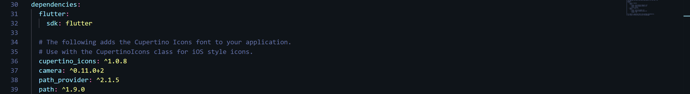
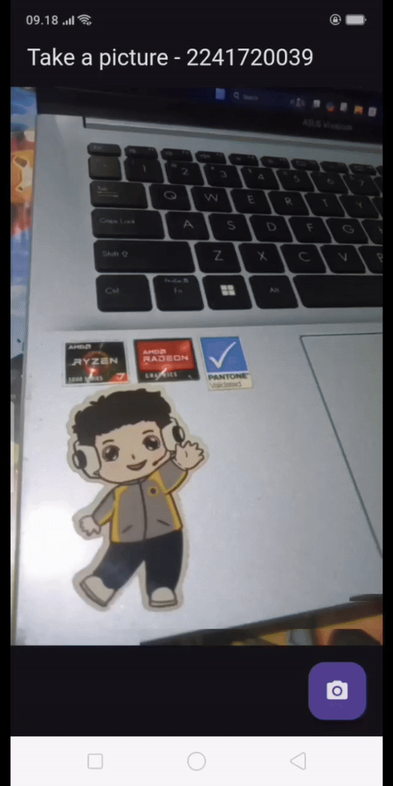

Disini saya membuat project baru dengan nama tugas_soal2 dimana isinya sama dengan praktikum 2 sebelumnya (photo_filter_carousel). Oleh sebab itu, belum ada kamera untuk mengambil gambar maka dilakukan modifikasi sebagai berikut: 

# Langkah-Langkah
1. Menambahkan dependensi camera, path dan path_provider


2. menambahkan class TakePictureScreen (Anda bisa mengambil dari praktikum 1)
```dart
import 'package:flutter/material.dart';
import 'package:camera/camera.dart';
import 'package:tugas_soal2/widget/filter_carousel.dart';

class TakePictureScreen extends StatefulWidget {
  const TakePictureScreen({
    super.key,
    required this.camera,
  });

  final CameraDescription camera;

  @override
  TakePictureScreenState createState() => TakePictureScreenState();
}

class TakePictureScreenState extends State<TakePictureScreen> {
  late CameraController _controller;
  late Future<void> _initializeControllerFuture;

  @override
  void initState() {
    super.initState();

    _controller = CameraController(
      widget.camera,
      ResolutionPreset.medium,
    );

    _initializeControllerFuture = _controller.initialize();
  }

  @override
  void dispose() {
    _controller.dispose();
    super.dispose();
  }

  @override
  Widget build(BuildContext context) {
    return Scaffold(
      appBar: AppBar(title: const Text('Take a picture - 2241720039')),
      body: FutureBuilder<void>(
        future: _initializeControllerFuture,
        builder: (context, snapshot) {
          if (snapshot.connectionState == ConnectionState.done) {
            return CameraPreview(_controller);
          } else {
            return const Center(child: CircularProgressIndicator());
          }
        },
      ),
      floatingActionButton: FloatingActionButton(
        onPressed: () async {
          try {
            await _initializeControllerFuture;

            final image = await _controller.takePicture();

            if (!context.mounted) return;

            await Navigator.of(context).push(
              MaterialPageRoute(
                builder: (context) => PhotoFilterCarousel(
                  imagePath: image.path,
                ),
              ),
            );
          } catch (e) {
            print(e);
          }
        },
        child: const Icon(Icons.camera_alt),
      ),
    );
  }
}
```
Kode program tersebut membuat halaman yang memungkinkan user untuk mengambil foto menggunakan kamera dan kemudian menerapkan filter pada foto.

# Output
